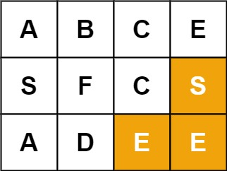

# 079. Word Search

Given an m x n grid of characters board and a string word, return true if word exists in the grid.

The word can be constructed from letters of sequentially adjacent cells, where adjacent cells are horizontally or vertically neighboring. The same letter cell may not be used more than once.

Note: There will be some test cases with a board or a word larger than constraints to test if your solution is using pruning.

[LeetCode](https://leetcode.com/problems/word-search)  

### Example 1:

```
Input: board = [["A","B","C","E"],["S","F","C","S"],["A","D","E","E"]], word = "ABCCED"
Output: true
```

### Example 2:

```
Input: board = [["A","B","C","E"],["S","F","C","S"],["A","D","E","E"]], word = "SEE"
Output: true
```

#  單詞搜索
給定一個二維網格和一個單詞，找出該單詞是否存在於網格中。

單詞必須按照字母順序，通過相鄰的單元格內的字母構成，其中“相鄰”單元格是那些水平相鄰或垂直相鄰的單元格。同一個單元格內的字母不允許被重覆使用

## Solution
* Dpeth First Search


### C

```
int move[4][2] = {{-1, 0}, {1, 0}, {0, -1}, {0, 1}};

bool DFS(char **board, int *boardSize, int *boardColSize, char *word, int *wordLen, int index, int **map, int row, int col)
{
    bool found = false;

    if (board[row][col] != word[index])
        return false;
    else if (index == *wordLen - 1)
    {
        printf("End search \n");
        return true;
    }

    printf("\nfound %c, %ith letter  on   %2i,%2i ,%c \n", word[index], index, row, col, board[row][col]);
    map[row][col] = 1;
    
    /*search next letter */
    int nextX;
    int nextY;
    for (int next = 0; next < 4; ++next)
    {
        nextX = row + move[next][0];
        nextY = col + move[next][1];

        printf("next possible location is %2i,%2i search for %c, %ith letter\n", nextX, nextY, word[index + 1], index + 1);
        if (    (row + move[next][0] >= 0) 
             && (row + move[next][0] < *boardSize) 
             && (col + move[next][1] >= 0) 
             && (col + move[next][1] < *boardColSize) 
             && (map[nextX][nextY] != 1))
        {
            printf("Execute search on %2i,%2i \n", row + move[next][0], col + move[next][1]);
            found = DFS(board, boardSize, boardColSize, word, wordLen, index + 1, map, nextX, nextY);

            if (found == true)
                return true;
        }
    }
    map[row][col] = 0;

    return found;
}

bool exist(char **board, int boardSize, int *boardColSize, char *word)
{

    /* First search the whole board to create a start point
     * than apply depth first search for the following letter
     * a map is also create to record letter that has been used */

    /* create map to record used spot */
    int **used = (int **)malloc(sizeof(int *) * boardSize);
    for (int i = 0; i < boardSize; ++i)
    {
        int *tmp = (int *)calloc(*boardColSize, sizeof(int));
        used[i] = tmp;
    }

    /* start search */
    bool found = false;
    int len = strlen(word);
    for (int i = 0; i < boardSize; ++i)
    {
        for (int j = 0; j < *boardColSize; ++j)
        {
            found = DFS(board, &boardSize, boardColSize, word, &len, 0, used, i, j);
            if (found == true)
                return true;
        }
    }

    return false;
}

int main()
{
    /* input */
    char a[] = {'A', 'B', 'C', 'E'};
    char b[] = {'S', 'F', 'C', 'S'};
    char c[] = {'A', 'D', 'E', 'E'};
    char *board[] = {a, b, c};
    int boardSize = sizeof(board) / sizeof(board[0]);
    int boardColSize = sizeof(a) / sizeof(a[0]);

    char word[] = {"ABCCED"};
    /*Algorithm*/
    bool ans = exist(board, boardSize, &boardColSize, word);
    /* print the result */

    return 0;
}
```
