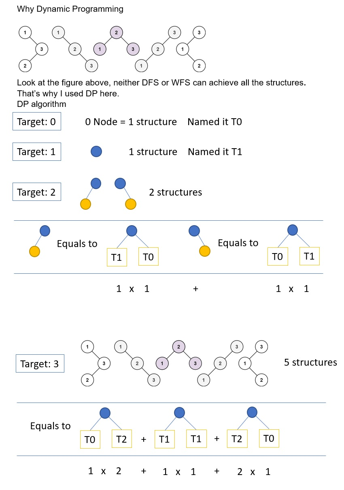

# 096. Unique Binary Search Trees

Given an integer n, return the number of structurally unique BST's (binary search trees) which has exactly n nodes of unique values from 1 to n.

[LeetCode](https://leetcode.com/problems/unique-binary-search-trees)  

### Example 1:

```
Input: n = 3
Output: 5
```

### Example 2:
```
Input: n = 1
Output: 1
```

#  不同的二叉搜索樹
給定一個整數 n，na u 1 ... n 為節點組成的二叉搜索樹有多少種？

## Solution
* Dynamic Programming


### C

```
int numTrees(int n)
{
    /**
     * When n > 1, starts dynamic programming
     * create an array to store result of each n
     * */

    int result[n + 1];
    memset(result, 0, sizeof(result));
    result[0] = 1;
    result[1] = 1;

    /*test for n = 2*/
    for (int val = 2; val <= n; ++val)
    {
        for (int i = 0; i < val; ++i)
        {
            result[val] += result[i] * result[val - 1 - i];
        }
    }

    return result[n];
}

int main()
{
    int ans = numTrees(4);

    return 0;
}
```
