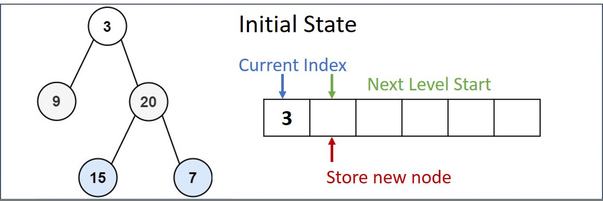

# 102. Binary Tree Level Order Traversal

Given the root of a binary tree, return the level order traversal of its nodes' values. (i.e., from left to right, level by level).

[LeetCode](https://leetcode.com/problems/binary-tree-level-order-traversal)  

### Example 1:


```
Input: root = [3,9,20,null,null,15,7]
Output: [[3],[9,20],[15,7]]
```

### Example 2:
```
Input: root = [1]
Output: [[1]]
```

### Example 2:
```
Input: root = []
Output: []
```

#  二叉樹的層序遍歷
給你一個二叉樹，請你返回其按 層序遍歷 得到的節點值。 （即逐層地，從左到右訪問所有節點）。

## Solution
* Breadth-First Search
* For BFS algorithm, an array was create to store the queue.


### C++

* 時間複雜度：O(n) N 為二叉樹的節點數量，即 BFS 需循環 N 次。

* 空間複雜度：最差情況下，即當樹為平衡二叉樹時，最多有 N/2 個樹節點同時在 queue 中，使用 O(N) 大小的額外空間。

```
#include <vector>
#include <queue>

using namespace std;

/*  Definition for a binary tree node.*/
struct TreeNode
{
    int val;
    TreeNode *left;
    TreeNode *right;
    TreeNode(int x) : val(x), left(NULL), right(NULL) {}
};

class Solution
{
public:
    vector<vector<int>> levelOrder(TreeNode *root)
    {
        vector<vector<int>> ret;

        if (root == nullptr)
            return ret;

        /* initial condition*/
        queue<TreeNode *> front;
        vector<int> levelList;
        front.emplace(root);

        while (front.empty() != true)
        {
            levelList.clear();
            int lvLen = front.size();
            for (int i = 0; i < lvLen; ++i)
            {
                TreeNode *tmp = front.front();
                front.pop();

                levelList.push_back(tmp->val);

                if(tmp->left != nullptr)
                    front.emplace(tmp->left);
                if(tmp->right != nullptr)
                    front.emplace(tmp->right);
            }
            ret.emplace_back(levelList);
        }

        return ret;
    }
};

int main()
{
    /* input*/
    TreeNode A(3), B(9), C(20), D(15), E(7);
    A.left = &B;
    A.right = &C;
    C.left = &D;
    C.right = &E;

    /* Test*/
    Solution test;
    vector<vector<int>> res = test.levelOrder(&A);

    return 0;
}
```

### C

```
/* Definition for a binary tree node. */
struct TreeNode
{
    int val;
    struct TreeNode *left;
    struct TreeNode *right;
};

#define MAX_LEN 5000

int **levelOrder(struct TreeNode *root, int *returnSize, int **returnColumnSizes)
{
    *returnSize = 0;
    if (root == NULL)
        return NULL;

    /* Create a array to store BFS search sequence */
    int **retAry = (int **)malloc(sizeof(int *) * MAX_LEN);
    struct TreeNode *queue[MAX_LEN];
    *returnColumnSizes = (int *)calloc(MAX_LEN, sizeof(int));

    /* Start Info*/
    int curtPtr = 0;
    int newLvStartPtr = 1;
    int newPtr = 1;
    int ansIndex = 0;

    /* Put root in the sequence*/
    queue[0] = root;

    /* Store first node*/
    retAry[0] = (int *)calloc(1, sizeof(int));
    retAry[0][0] = root->val;
    (*returnColumnSizes)[(*returnSize)++] = 1;

    int tmpCol[MAX_LEN];

    /* Start scan the binary tree*/
    while (queue[curtPtr] != NULL)
    {
        struct TreeNode tmp = *queue[curtPtr]; /* for debug*/

        if (queue[curtPtr]->left != NULL)
        {
            tmpCol[ansIndex++] = queue[curtPtr]->left->val;
            queue[newPtr++] = queue[curtPtr]->left;
        }

        if (queue[curtPtr]->right != NULL)
        {
            tmpCol[ansIndex++] = queue[curtPtr]->right->val;
            queue[newPtr++] = queue[curtPtr]->right;
        }

        ++curtPtr;

        /**
         *  scan this level complete, store the result
         **/
        if (curtPtr == newLvStartPtr && ansIndex != 0)
        {
            retAry[*returnSize] = (int *)malloc(sizeof(int) * ansIndex);
            (*returnColumnSizes)[*returnSize] = ansIndex;
            memcpy(retAry[*returnSize], tmpCol, sizeof(int) * ansIndex);
            newLvStartPtr = newPtr;
            ++*returnSize;
            ansIndex = 0;
        }
    }

    return retAry;
}

int main()
{
    /* input*/
    struct TreeNode A, B, C, D, E, F, G, H, I, J;
    A.left = &B;
    A.right = &C;
    A.val = 0;

    B.left = &D;
    B.right = NULL;
    B.val = 2;

    C.left = &E;
    C.right = &F;
    C.val = 4;

    D.left = NULL;
    D.right = NULL;
    D.val = 1;

    E.left = NULL;
    E.right = NULL;
    E.val = 3;

    F.left = NULL;
    F.right = NULL;
    F.val = -1;

    G.val = 5;
    G.left = NULL;
    G.right = NULL;

    H.val = 1;
    H.left = NULL;
    H.right = NULL;

    I.val = 6;
    I.left = NULL;
    I.right = NULL;

    J.val = 8;
    J.left = NULL;
    J.right = NULL;

    int returnSize = 0;
    int **returnColumnSizes = (int **)malloc(sizeof(int *));

    /* test */

    int **ans = levelOrder(&A, &returnSize, returnColumnSizes);

    /* print result */
    for (int i = 0; i < returnSize; ++i)
    {
        printf("[ ");
        for (int j = 0; j < (*returnColumnSizes)[i]; ++j)
        {
            printf("%i ", ans[i][j]);
        }
        printf("]\n");
    }

    return 0;
}
```
