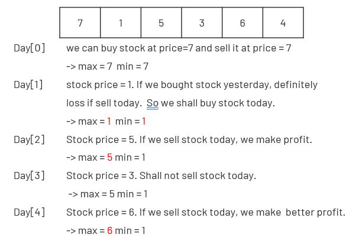

# Best Time to Buy and Sell Stock
Say you have an array for which the ith element is the price of a given stock on day i.  
If you were only permitted to complete at most one transaction  
(i.e., buy one and sell one share of the stock), design an algorithm to find the maximum profit.) 

Note that you cannot sell a stock before you buy one.

[LeetCode](https://leetcode.com/problems/best-time-to-buy-and-sell-stock/)  

### Example 1:
```
Input: [7,1,5,3,6,4]
Output: 5
Explanation: Buy on day 2 (price = 1) and sell on day 5 (price = 6), profit = 6-1 = 5.
             Not 7-1 = 6, as selling price needs to be larger than buying price.
```
### Example 2:
```
Input: [7,6,4,3,1]
Output: 0
Explanation: In this case, no transaction is done, i.e. max profit = 0.
```
# 買賣股票的最佳時機
給定一個數組，它的第 i 個元素是一支給定股票第 i 天的價格。  
如果你最多只允許完成一筆交易（即買入和賣出一支股票一次），設計一個算法來計算你所能獲取的最大利潤。  
注意：你不能在買入股票前賣出股票。

# Solution
  

## C

```
int maxProfit(int* prices, int pricesSize){
    if (pricesSize == 0)
        return 0;

    int max = prices[0];
    int min = prices[0];
    int res = 0;

    for(int i = 1; i < pricesSize; ++i){
        if(prices[i] < min)
            max = min = prices[i];
        else if(prices[i] > max)
            max = prices[i];
            
        if((max-min) > res)
            res = max-min;        
    }

    return res;
}
```


