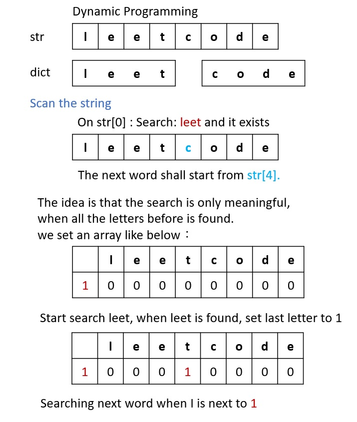

# 139. Word Break

Given a string s and a dictionary of strings wordDict, return true if s can be segmented into a space-separated sequence of one or more dictionary words.

Note that the same word in the dictionary may be reused multiple times in the segmentation.

[LeetCode](https://leetcode.com/problems/word-break)  

### Example 1:

```
Input: s = "leetcode", wordDict = ["leet","code"]
Output: true
Explanation: Return true because "leetcode" can be segmented as "leet code".
```

### Example 2:
```
Input: s = "applepenapple", wordDict = ["apple","pen"]
Output: true
Explanation: Return true because "applepenapple" can be segmented as "apple pen apple".
Note that you are allowed to reuse a dictionary word.
```

### Example 3:
```
Input: s = "catsandog", wordDict = ["cats","dog","sand","and","cat"]
Output: false
```

#  單詞拆分
給定一個非空字符串 s 和一個包含非空單詞的列表 wordDict，判定 s 是否可以被空格拆分為一個或多個在字典中出現的單詞。

說明：

拆分時可以重覆使用字典中的單詞。
你可以假設字典中沒有重覆的單詞。

## Solution
* DP



### C++

```
#include <vector>
#include <string>

using namespace std;

class Solution
{
public:
    bool wordBreak(string s, vector<string> &wordDict)
    {
        /* dynamic programmin, record position can be reach */
        /* example : leetcode, create dp space with sizeof(leetcode)+1
         * set dp[0] = 1 mean we can start search after 1*/

        int len = s.size();

        /* allocate dp space and initiazlie it */
        vector<bool> dp(len + 1, false);
        dp[0] = true;
        int foundId = 0;
        int nextStart = 0;
        /* dynammic programming*/
        for (int i = 1; i <= len; ++i)
        {
            if (dp[i - 1] != true)
                continue;
            for (const string &word : wordDict)
            {
                foundId = s.find(word, i - 1); /* for debug*/
                if (foundId == i - 1)
                {
                    nextStart = i + word.size() - 1;
                    dp[nextStart] = true;
                    if (nextStart == len)
                        return true;
                }
            }
        }

        return dp[len];
    }
};

int main()
{
    /* Input*/
    string input = "applepenapple";

    vector<string> wordDict = {"apple", "pen"};

    /* unit test*/
    Solution test;
    test.wordBreak(input, wordDict);

    int test2 = input.find("leet", 2);

    return 0;
}
```

### C

```
bool wordBreak(char *s, char **wordDict, int wordDictSize)
{
    int strLen = strlen(s);
    bool DP[strLen + 1];
    memset(DP, 0, sizeof(DP));
    DP[0] = true;

    /**
     *  create an array to store len of each word
     **/
    int dictKeyLen[wordDictSize];
    for (int i = 0; i < wordDictSize; ++i)
        dictKeyLen[i] = strlen(wordDict[i]);

    /* DP algorithm*/
    int keyLen = 0;
    for (int i = 1; i <= strLen; ++i)
    {
        for (int j = 0; j < wordDictSize; ++j)
        {
            if (DP[i] == true)
                break;
            keyLen = dictKeyLen[j];
            if (((i - keyLen) >= 0) && (DP[i - keyLen] == true))
            {
                if (strncmp(s + i - keyLen, wordDict[j], keyLen) == 0)
                    DP[i] = true;
            }
        }
    }

    return DP[strLen];
}

int main()
{

    /* input */
    char s[] = {"catsandog "};

    char A[] = {"cats"};
    char B[] = {"dog"};
    char C[] = {"sand"};
    char D[] = {"and"};
    char E[] = {"cat"};
    int size = 5;
    char *wordDict[size] = {A, B, C, D, E};

    /* Algorithm */
    bool ans = wordBreak(s, wordDict, size);

    return 0;
}
```

* DFS
### C

```
bool DFS(char *s, char **wordDict, int *wordDictSize, int *wordDictLen, bool *map, int lastIndex, int mapLen)
{
    if (*s == '\0')
        return true;

    for (int i = 0; i < *wordDictSize; ++i)
    {
        if ((lastIndex + wordDictLen[i] >= mapLen) || (map[lastIndex + wordDictLen[i]] == true))
            continue;

        if (strncmp(s, wordDict[i], wordDictLen[i]) == 0)
        {
            map[lastIndex + wordDictLen[i]] = true;
            if (DFS(s + wordDictLen[i], wordDict, wordDictSize, wordDictLen, map, lastIndex + wordDictLen[i], mapLen) == true)
                return true;
        }
    }

    return false;
}

bool wordBreak(char *s, char **wordDict, int wordDictSize)
{
    int strLen = strlen(s);
    bool DP[strLen + 1];
    memset(DP, 0, sizeof(DP));

    /**
     *  create an array to store len of each word
     **/
    int dictKeyLen[wordDictSize];
    for (int i = 0; i < wordDictSize; ++i)
        dictKeyLen[i] = strlen(wordDict[i]);

    return DFS(s, wordDict, &wordDictSize, dictKeyLen, DP, 0, strLen + 1);
}

int main()
{

    /* input */
    char s[] = {"abcd"};

    char A[] = {"a"};
    char B[] = {"abc"};
    char C[] = {"b"};
    char D[] = {"cd"};
    int size = 4;
    char *wordDict[size] = {A, B, C, D};

    /* Algorithm */
    bool ans = wordBreak(s, wordDict, size);

    return 0;
}
```