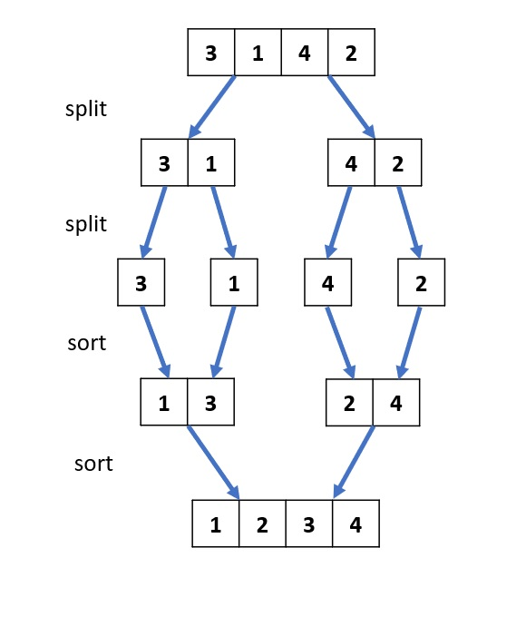

# 148. Sort List
Given the head of a linked list, return the list after sorting it in ascending order.

Follow up: Can you sort the linked list in O(n logn) time and O(1) memory (i.e. constant space)?

[LeetCode](https://leetcode.com/problems/sort-list)  

### Example 1:


```
Input: head = [4,2,1,3]
Output: [1,2,3,4]
```


# 排序鍊表

給你鏈表的頭結點 head ，請將其按 升序 排列並返回 排序後的鏈表 。

進階：

你可以在 O(n log n) 時間覆雜度和常數級空間覆雜度下，對鏈表進行排序嗎？

## Solution

### C


```
/**
  Definition for singly-linked list. */
struct ListNode
{
  int val;
  struct ListNode *next;
};

struct ListNode *merge(struct ListNode *listA, struct ListNode *listB)
{
  if (listA == NULL || listB == NULL)
    return listA == NULL ? listB : listA;

  if (listA->val < listB->val)
  {
    listA->next = merge(listA->next, listB);
    return listA;
  }
  else
  {
    listB->next = merge(listA, listB->next);
    return listB;
  }
}

struct ListNode *divideList(struct ListNode *head, struct ListNode *tail)
{
  if (head == NULL)
    return head;

  if (head->next == tail)
  {
    head->next = NULL;
    return head;
    ;
  }

  /* use fast slow pointer to divide list*/
  struct ListNode *fast = head;
  struct ListNode *slow = head;

  while (fast != tail)
  {
    fast = fast->next;
    slow = slow->next;
    if (fast != tail)
      fast = fast->next;
  }

  return merge(divideList(head, slow), divideList(slow, tail));
}

struct ListNode *sortList(struct ListNode *head)
{
  return divideList(head, NULL);
}

int main()
{
  struct ListNode A, B, C, D;
  A.val = 3;
  A.next = &B;
  B.val = 1;
  B.next = &C;
  C.val = 2;
  C.next = &D;
  D.val = 4;
  D.next = NULL;

  struct ListNode* ans =  sortList(&A);

  return 0;
}
```