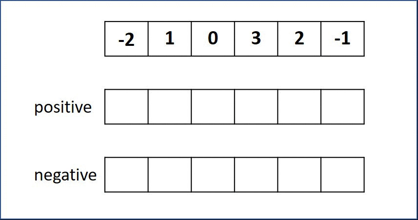

# 152. Maximum Product Subarray
Given an integer array nums, find a contiguous non-empty subarray within the array that has the largest product, and return the product.

It is guaranteed that the answer will fit in a 32-bit integer.

A subarray is a contiguous subsequence of the array.

[LeetCode](https://leetcode.com/problems/maximum-product-subarray)  

### Example 1:
```
Input: nums = [2,3,-2,4]
Output: 6
Explanation: [2,3] has the largest product 6.
```

### Example 2:
```
Input: nums = [-2,0,-1]
Output: 0
Explanation: The result cannot be 2, because [-2,-1] is not a subarray.
```


# 乘積最大整組組

給你一個整數數組 nums ，請你找出數組中乘積最大的連續子數組（該子數組中至少包含一個數字），並返回該子數組所對應的乘積。


## Solution

### C++
* Dynamic Programming


```
#include <vector>
#include <algorithm>

using namespace std;

class Solution
{
public:
    int maxProduct(vector<int> &nums)
    {
        /**  dynammic programming
         *   store postive and negative products separately
         */
        int len = nums.size();

        /* allocate dp space*/
        vector<int> posProduct(len, 0);
        vector<int> negProduct(len, 0);

        /* dp initiative state*/
        posProduct[0] = max(posProduct[0], nums[0]);
        negProduct[0] = min(negProduct[0], nums[0]);

        /* dynammic programming*/
        int posTemp = 0;
        int negTemp = 0;
        int maxProduct = 0;
        for (int i = 1; i < len; ++i)
        {
            posTemp = posProduct[i - 1] * nums[i];
            negTemp = negProduct[i - 1] * nums[i];

            posProduct[i] = max(max(posTemp, nums[i]), negTemp);
            negProduct[i] = min(min(posTemp, nums[i]), negTemp);
            maxProduct = max(maxProduct, max(posProduct[i], negProduct[i]));
        }

        return maxProduct;
    }
};

int main()
{
    /* Input*/
    vector<int> input = {-2, 1, 0, 3, 2, -1};

    /* unit test*/
    Solution test;
    int res = test.maxProduct(input);

    return 0;
}
```

### C
```
int maxProduct(int *nums, int numsSize)
{
  if (numsSize == 1)
    return *nums;

  /** 
   *  Dynamic Programming
   *  TODO: Store result from last step
   ***/
  
  int i = 0;

  int prevPos = nums[i] > 0 ? nums[i] : 0;
  int prevNeg = nums[i] < 0 ? nums[i] : 0;

  int tmpMax = prevPos;
  int tmp;

  for (i = 1; i < numsSize; ++i)
  {
    if(nums[i] < 0)
        {
            tmp = prevPos;
            prevPos = prevNeg;
            prevNeg = tmp;
        }
    
      prevPos = nums[i] * prevPos > nums[i] ? nums[i] * prevPos : nums[i];
      prevNeg = nums[i] * prevNeg < nums[i] ? nums[i] * prevNeg : nums[i];

      tmpMax = prevPos > tmpMax ? prevPos : tmpMax;    
    
  }
  return tmpMax;
}

int main()
{
  int input[] = {-3,-1,-1};
  int ans = maxProduct(input, sizeof(input) / sizeof(input[0]));

  return 0;
}
```