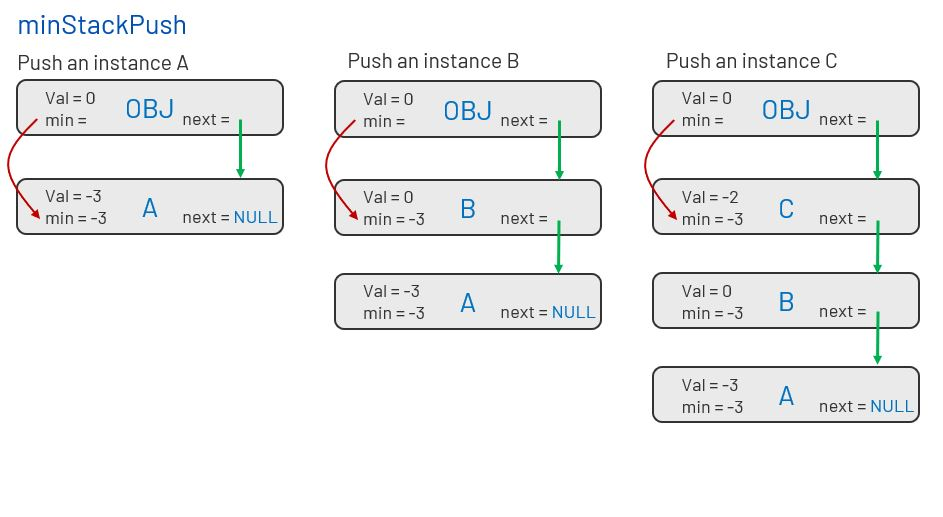

# 155. Min Stack
Design a stack that supports push, pop, top, and retrieving the minimum element in constant time.

push(x) -- Push element x onto stack.
pop() -- Removes the element on top of the stack.
top() -- Get the top element.
getMin() -- Retrieve the minimum element in the stack.

[LeetCode](https://leetcode.com/problems/min-stack/)  

### Example 1:
```
Input
["MinStack","push","push","push","getMin","pop","top","getMin"]
[[],[-2],[0],[-3],[],[],[],[]]

Output
[null,null,null,null,-3,null,0,-2]

Explanation
MinStack minStack = new MinStack();
minStack.push(-2);
minStack.push(0);
minStack.push(-3);
minStack.getMin(); // return -3
minStack.pop();
minStack.top();    // return 0
minStack.getMin(); // return -2
```

# 最小棧
設計一個支持 push ，pop ，top 操作，並能在常數時間內檢索到最小元素的棧。

push(x) —— 將元素 x 推入棧中。
pop() —— 刪除棧頂的元素。
top() —— 獲取棧頂元素。
getMin() —— 檢索棧中的最小元素。


# Solution  
As shown in figure below, minumun value stored in Obj is the min value stored in the top instance.
Each time a new instance is pushed, a new instance is inserted into the handle Obj and top instance.  



## C

```
typedef struct MinStack{
    int val;
    int min;
    struct MinStack* next;
}MinStack;

MinStack* minStackCreate()
{
    MinStack* temp = (MinStack*)malloc(sizeof(MinStack));
    temp->min = 0;
    temp->val = 0;
    temp->next = NULL;

    return temp;
}

void minStackPush(MinStack* obj, int x) {
    MinStack* temp = (MinStack*)malloc(sizeof(MinStack));
    temp->val = x;

    if(obj->next == NULL){
        obj->min = temp->min = x;        
        obj->next = temp;        
        temp->next = NULL;
    }
    else{
        obj->min = obj->min > x? x:obj->min;
        temp->min = obj->min;
        temp->next = obj->next;
        obj->next = temp;           
    }

}

void minStackPop(MinStack* obj) {
    MinStack* temp = obj->next;

    if(temp->next != NULL){
        obj->min = temp->next->min;
        obj->next = temp->next;    
    }
    else{
        obj->min = 0;
        obj->next = NULL;
    }
    free(temp);
}

int minStackGetMin(MinStack* obj) {
    return obj->min;
}

int minStackTop(MinStack* obj) {
    return obj->next->val;

}

void minStackFree(MinStack* obj) {
    MinStack* temp = obj;

    while(temp != NULL){
    obj = obj->next;
    free(temp);
    temp = obj;
    }

}
```


