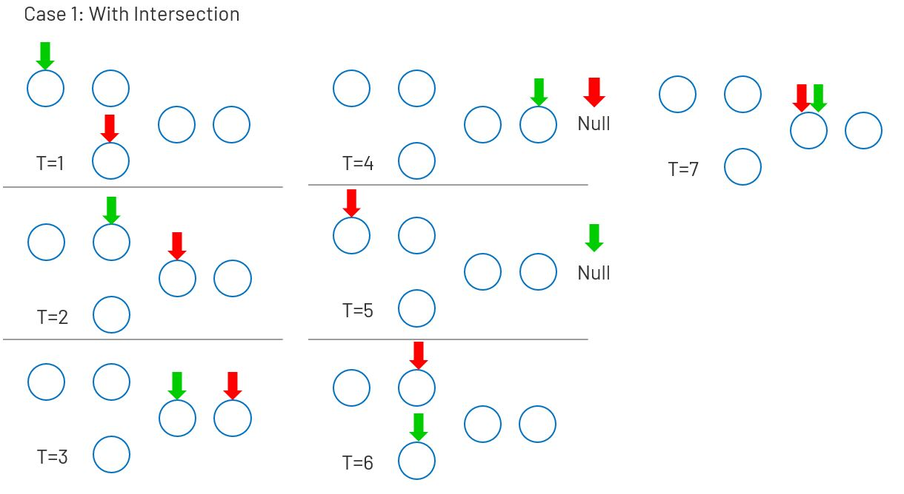
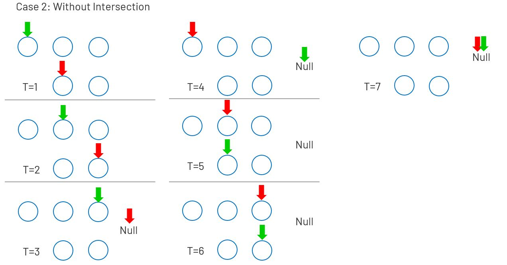

# 160. Intersection of Two Linked Lists
Write a program to find the node at which the intersection of two singly linked lists begins.

For example, the following two linked lists:


begin to intersect at node c1.

[LeetCode](https://leetcode.com/problems/intersection-of-two-linked-lists/)  


# 相交鍊表
編寫一個程序，找到兩個單鍊錶相交的起始節點。


## Solution  
  





### C

```
struct ListNode *getIntersectionNode(struct ListNode *headA, struct ListNode *headB) {
    struct ListNode * startA = headA;
    struct ListNode * startB = headB;

    while (headA != headB){
        if(headA == NULL)
            headA = startB;
        else
            headA = headA->next;
        
        if(headB == NULL)
            headB = startA;
        else
            headB = headB->next;                
    }

    return headA;   
}
```


