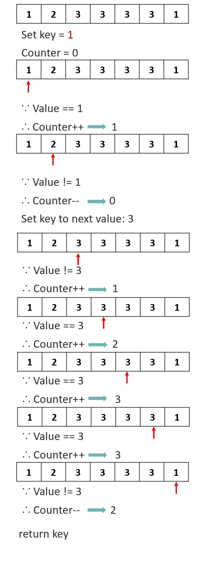

# 169. Majority Element
Given an array of size n, find the majority element. The majority element is the element that appears more than ⌊ n/2 ⌋ times.

You may assume that the array is non-empty and the majority element always exist in the array.

[LeetCode](https://leetcode.com/problems/majority-element/)

### Example 1:
```
Input: [3,2,3]
Output: 3
```

### Example 2:
```
Input: [2,2,1,1,1,2,2]
Output: 2
```


# 多數元素
給定一個大小為 n 的數組，找到其中的多數元素。多數元素是指在數組中出現次數 大於 ⌊ n/2 ⌋ 的元素。

你可以假設數組是非空的，並且給定的數組總是存在多數元素。


## Solution  
## Moore Voting Algorithm
  


## C

```
int majorityElement(int* nums, int numsSize){
    int key = nums[0];
    int count = 0;
    for(int i = 0; i < numsSize; i++){
        if(key == nums[i])
            count++;
        else
            count--;

        if (count <= 0)
            key = nums[i+1];
            count = 0;
    }

    return key;
}
```


