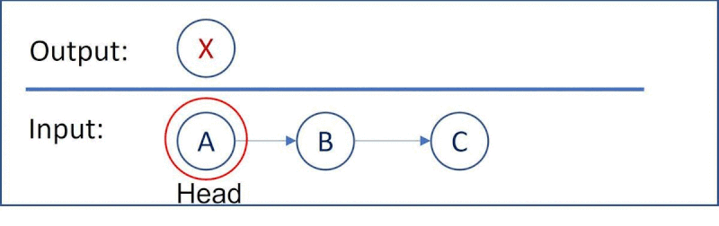

# 206. Reverse Linked List
Reverse a singly linked list.

## 反轉鍊表
反轉一個單鍊表

[LeetCode](https://leetcode.com/problems/reverse-linked-list/)

### Example :
```
Input: 1->2->3->4->5->NULL
Output: 5->4->3->2->1->NULL
```

## Solution  
## iteration
  


### C++

* 時間複雜度 O( n )

* 空間複雜度 O( n )
```
/* Definition for singly-linked list. */
struct ListNode
{
    int val;
    ListNode *next;
    ListNode(int x) : val(x), next(NULL) {}
};

class Solution
{
public:
    ListNode *reverseList(ListNode *head)
    {
        ListNode *revHead = nullptr;
        ListNode *tmpRevTail = nullptr;

        while (head != nullptr)
        {
            revHead = head;
            head = head->next;
            revHead->next= tmpRevTail; 
            tmpRevTail = revHead;            
        }

        return revHead;
    }
};

int main()
{
    /* input*/
    ListNode A(1), B(3), C(5);
    A.next = &B;
    B.next = &C;

    /* Test*/
    Solution test;
    ListNode *res = test.reverseList(&A);

    return 0;
}
```

### C

```
struct ListNode* reverseList(struct ListNode* head){
    if (head == NULL)
        return NULL;
        
    struct ListNode* tmp = NULL;
    struct ListNode* tmp_later = NULL;

    while(head != NULL){
        tmp_later = tmp;
        tmp = head;
        head = head->next;
        tmp->next = tmp_later;
    }

    return tmp;
}
```