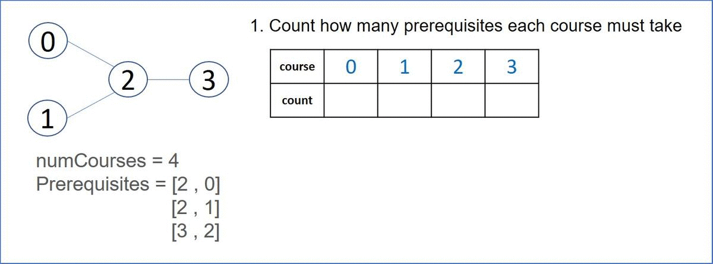

# 207. Course Schedule
There are a total of numCourses courses you have to take, labeled from 0 to numCourses - 1. You are given an array prerequisites where prerequisites[i] = [ai, bi] indicates that you must take course bi first if you want to take course ai.

For example, the pair [0, 1], indicates that to take course 0 you have to first take course 1.
Return true if you can finish all courses. Otherwise, return false.

[LeetCode](https://leetcode.com/problems/course-schedule/)

### Example 1:
```
Input: numCourses = 2, prerequisites = [[1,0]]
Output: true
Explanation: There are a total of 2 courses to take. 
To take course 1 you should have finished course 0. So it is possible.
```

### Example 2:
```
Input: numCourses = 2, prerequisites = [[1,0],[0,1]]
Output: false
Explanation: There are a total of 2 courses to take. 
To take course 1 you should have finished course 0, and to take course 0 you should also have finished course 1. So it is impossible.
```

# 課程表
你這個學期必須選修 numCourses 門課程，記為 0 到 numCourses - 1 。

在選修某些課程之前需要一些先修課程。 先修課程按數組 prerequisites 給出，其中 prerequisites[i] = [ai, bi] ，表示如果要學習課程 ai 則 必須 先學習課程  bi 。

例如，先修課程對 [0, 1] 表示：想要學習課程 0 ，你需要先完成課程 1 。
請你判斷是否可能完成所有課程的學習？如果可以，返回 true ；否則，返回 false 。


## Solution  
* Breadth-First Search


### C++

```
class Solution {
public:
    bool canFinish(int numCourses, vector<vector<int>>& prerequisites) {
        //建立有向圖，並統記所有的prerequisites，記錄其出現的次數        
        vector<int> count(numCourses,0);
        unordered_map<int, vector<int>> map;
        for(const auto& req : prerequisites)
        {    
            count[req[0]]++;
            map[req[1]].push_back(req[0]);
        }       
        //將不用先修課程的入隊
        queue<int> frontier;
        for(int i = 0; i < numCourses; ++i)
        {
            if(count[i] == 0)
                frontier.push(i);
        }

        // BFS 拓展
        int&& finished = 0;
        while(frontier.empty() != true)
        {
            ++finished;
            int temp = frontier.front();
            frontier.pop();
            for(const int& val: map[temp])
            {
                if(--count[val]== 0)
                    frontier.push(val); 
            }   
        }
        return finished == numCourses;
    }
};
```


