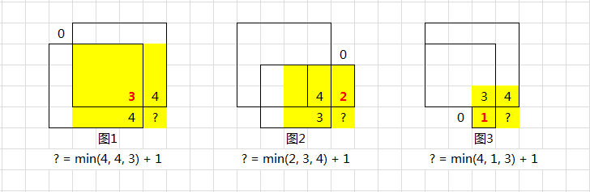

# 221. Maximal Square

Given an m x n binary matrix filled with 0's and 1's, find the largest square containing only 1's and return its area.

[LeetCode](https://leetcode.com/problems/maximal-square)

### Example 1:


```
Input: matrix = [["1","0","1","0","0"],["1","0","1","1","1"],["1","1","1","1","1"],["1","0","0","1","0"]]
Output: 4
```

### Example 2:


```
Input: matrix = [["0","1"],["1","0"]]
Output: 1
```

# 最大正方形
在一個由 '0' 和 '1' 組成的二維矩陣內，找到只包含 '1' 的最大正方形，並返回其面積。


## Solution  
* Dynamic Programming



### C++

```
class Solution
{
public:
    int maximalSquare(vector<vector<char>> &matrix)
    {
        if (matrix.size() == 0 || matrix[0].size() == 0)
            return 0;

        int rowNum = matrix.size();
        int colNum = matrix[0].size();
        int maxSide = 0;

        /* dynammic programming*/
        /* initialize*/
        vector<vector<int>> dp(rowNum, vector<int>(colNum, 0));

        /* go through the matrix*/
        for (int row = 0; row < rowNum; ++row)
        {
            for (int col = 0; col < colNum; ++col)
            {
                if ((row == 0 || col == 0) && matrix[row][col] == '1')
                {
                    dp[row][col] = 1;
                    maxSide = max(maxSide, dp[row][col]);
                    continue;
                }

                if (matrix[row][col] == '1')
                {
                    dp[row][col] =
                        min(min(dp[row - 1][col - 1], dp[row][col - 1]), dp[row - 1][col]) + 1;

                    maxSide = max(dp[row][col], maxSide);
                }
            }
        }

        return maxSide * maxSide;
    }
};

int main()
{
    //vector<vector<char>> input = {{'1', '0', '1', '0', '0'}, {'1', '0', '1', '1', '1'}, {'1', '1', '1', '1', '1'}, {'1', '0', '0', '1', '0'}};
    vector<vector<char>> input = {{'1','0','1','0','0'},{'1','0','1','1','1'},{'1','1','1','1','1'},{'1','0','0','1','0'}};

    Solution test;
    int res = test.maximalSquare(input);

    return 0;
}
```

### C

```
int maximalSquare(char **matrix, int matrixSize, int *matrixColSize)
{
  /**
   * TODO: Set Dynamic Programming map
   * */
  int dp[matrixSize][*matrixColSize];
  int a = sizeof(dp);
  memset(dp, 0, sizeof(dp));

  

  /**
   * TODO: Dynamic programming
   *       For each position, take the min value of left, up, left-up than plus 1
   * */

  int maxSize = 0;

  for (int i = 0; i < matrixSize; ++i)
  {
    for (int j = 0; j < *matrixColSize; ++j)
    {
      if (matrix[i][j] == '1')
      {
        if ((i == 0) || (j == 0))
          dp[i][j] = matrix[i][j] == '1' ? 1 : 0;
        else
          dp[i][j] = fmin(fmin(dp[i - 1][j], dp[i - 1][j - 1]), dp[i][j - 1]) + 1;
        
        maxSize = dp[i][j] > maxSize ? dp[i][j] : maxSize; 
      }
    }
  }

  return maxSize * maxSize;
}

int main()
{

  char a[] = {'1', '0', '1', '0', '0'};
  char b[] = {'1', '0', '1', '1', '1'};
  char c[] = {'1', '1', '1', '1', '1'};
  char d[] = {'1', '0', '0', '1', '0'};

  char *matrix[] = {a, b, c, d};
  int matrixSize = sizeof(matrix) / sizeof(matrix[0]);
  int matrixColSize = sizeof(a) / sizeof(a[0]);

  int ans = maximalSquare(matrix, matrixSize, &matrixColSize);

  return 0;
}
```
