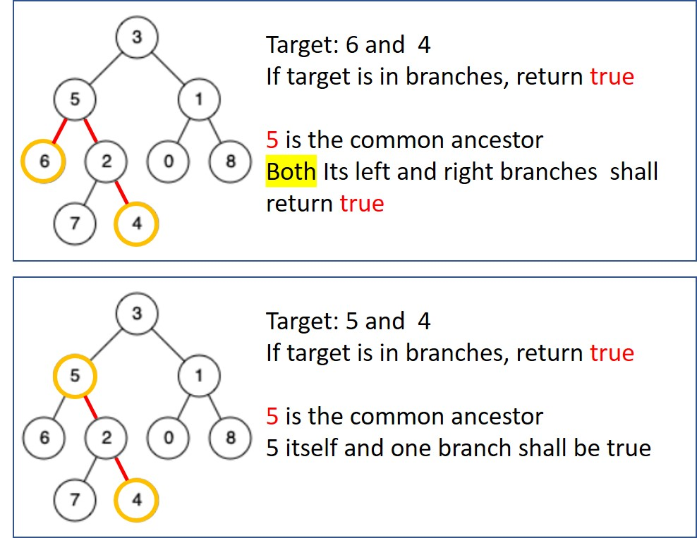

# 236. Lowest Common Ancestor of a Binary Tree

Given a binary tree, find the lowest common ancestor (LCA) of two given nodes in the tree.

According to the definition of LCA on Wikipedia: “The lowest common ancestor is defined between two nodes p and q as the lowest node in T that has both p and q as descendants (where we allow a node to be a descendant of itself).”

[LeetCode](https://leetcode.com/problems/lowest-common-ancestor-of-a-binary-tree)

### Example 1:


```
Input: root = [3,5,1,6,2,0,8,null,null,7,4], p = 5, q = 1
Output: 3
Explanation: The LCA of nodes 5 and 1 is 3.
```

### Example 2:

```
Input: root = [3,5,1,6,2,0,8,null,null,7,4], p = 5, q = 4
Output: 5
Explanation: The LCA of nodes 5 and 4 is 5, since a node can be a descendant of itself according to the LCA definition.
```

# 二叉樹的最近公共祖先
給定一個二叉樹, 找到該樹中兩個指定節點的最近公共祖先。

百度百科中最近公共祖先的定義為：“對於有根樹 T 的兩個節點 p、q，最近公共祖先表示為一個節點 x，滿足 x 是 p、q 的祖先且 x 的深度盡可能大（一個節點也可以是它自己的祖先）。”

## Solution  
* Recursion



### C++

* 時間複雜度 O(n)

* 空間複雜度 O(n)

```
class Solution
{
private:
    TreeNode *ret{nullptr};
    bool dfs(TreeNode *root, TreeNode *p, TreeNode *q)
    {
        if (root == nullptr || ret != nullptr)
            return false;

        bool left = dfs(root->left, p, q);
        bool right = dfs(root->right, p, q);

        bool curr = (root == p || root == q);
        if( (left == true && right == true) || (curr == true && (left == true || right == true)))
            ret = root;

        return curr || left || right;    
    }

public:
    TreeNode *lowestCommonAncestor(TreeNode *root, TreeNode *p, TreeNode *q)
    {
        (void)dfs(root, p, q);

        return ret;
    }
};
```

### C

```
/*Definition for a binary tree node.*/
struct TreeNode
{
  int val;
  struct TreeNode *left;
  struct TreeNode *right;
};

bool DFS(struct TreeNode *root, struct TreeNode *p, struct TreeNode *q, struct TreeNode **res, bool *found)
{
  /* recursion end condition*/
  if (root == NULL)
    return false;

  /* checkt if current node match target*/
  bool thisNodeMatch = root == p || root == q;

  /* recursion search left and right branch */
  bool left = false;
  bool right = false;

  if (*found != true)
    left = DFS(root->left, p, q, res, found);
  if (*found != true)
    right = DFS(root->right, p, q, res, found);

  if (((left == true) && (right == true)) || ((thisNodeMatch == true) && ((left == true) || (right == true))))
  {
    *res = root;
    *found = true;
  }

  return (left == true) || (right == true) || (thisNodeMatch == true);
}

struct TreeNode *lowestCommonAncestor(struct TreeNode *root, struct TreeNode *p, struct TreeNode *q)
{
  struct TreeNode *ret = NULL;
  bool found = false;
  (void)DFS(root, p, q, &ret, &found);

  return ret;
}

int main()
{
  struct TreeNode A, B, C, D, E, F, G, H, I, J;
  A.val = 3;
  A.left = &B;
  A.right = &C;
  B.val = 5;
  B.left = NULL;  
  B.right = NULL; 
  C.val = 1;
  C.left = NULL;  
  C.right = NULL; 
  
  struct TreeNode *ans = lowestCommonAncestor(&A, &A, &C);

  return 0;
}
```
