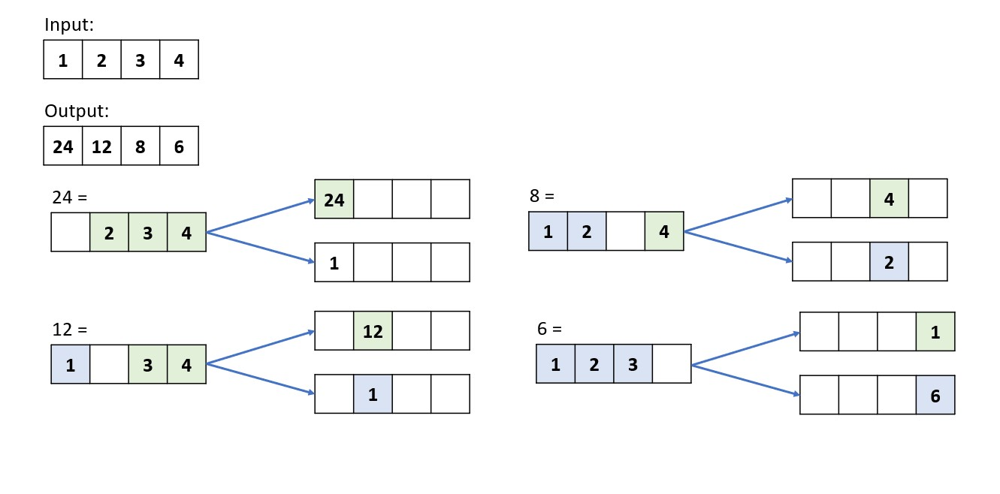

# 238. Product of Array Except Self
Given an integer array nums, return an array answer such that answer[i] is equal to the product of all the elements of nums except nums[i].

The product of any prefix or suffix of nums is guaranteed to fit in a 32-bit integer.

[LeetCode](https://leetcode.com/problems/product-of-array-except-self)

### Example 1:
```
Input: nums = [1,2,3,4]
Output: [24,12,8,6]
```

### Example 2:
```
Input: nums = [-1,1,0,-3,3]
Output: [0,0,9,0,0]
```
#  除自身以外數組的乘積
給你一個長度為 n 的整數數組 nums，其中 n > 1，返回輸出數組 output ，其中 output[i] 等於 nums 中除 nums[i] 之外其余各元素的乘積。

## Solution  


### C



```
int *productExceptSelf(int *nums, int numsSize, int *returnSize)
{
  *returnSize = numsSize;
  /**
   * TODO:  create two arrays: one store results from left
   *        one store from right
   **/
  int left[numsSize];
  int right[numsSize];
  left[0] = 1;
  right[numsSize - 1] = 1;

  for (int i = 1; i < numsSize; ++i)
  {
    left[i] = nums[i - 1] * left[i - 1];
    right[numsSize - 1 - i] = nums[numsSize - i] * right[numsSize - i];
  }

  /**
   * TODO: allocate memory to store result 
   * */
  int *ret = (int *)malloc(numsSize * sizeof(int));

  for (int i = 0; i < numsSize; ++i)
  {
    ret[i] = left[i] * right[i];
  }

  return ret;
}

int main()
{

  int nums[] = {1, 2, 3, 4};

  int returnSize = 0;

  int *ans = productExceptSelf(nums, sizeof(nums) / sizeof(nums[0]), &returnSize);

  return 0;
}
```


