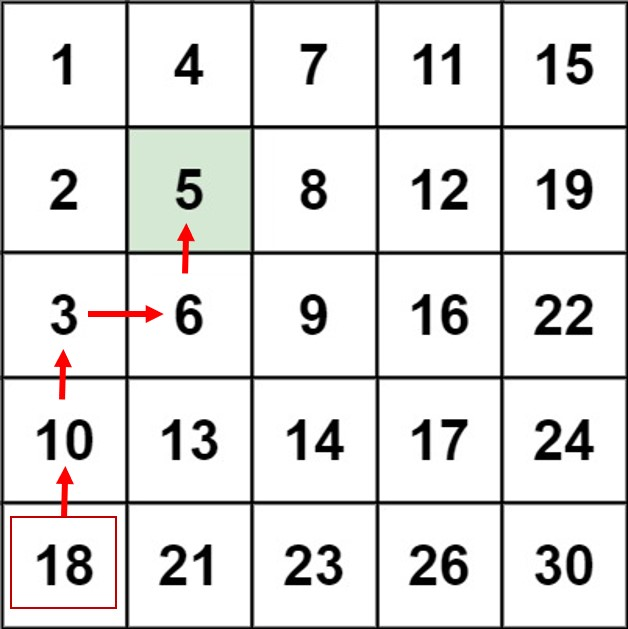

# 240. Search a 2D Matrix II
Write an efficient algorithm that searches for a target value in an m x n integer matrix. The matrix has the following properties:

* Integers in each row are sorted in ascending from left to right.
* Integers in each column are sorted in ascending from top to bottom.

[LeetCode](https://leetcode.com/problems/search-a-2d-matrix-ii)

### Example 1:


```
Input: matrix = [[1,4,7,11,15],[2,5,8,12,19],[3,6,9,16,22],[10,13,14,17,24],[18,21,23,26,30]], target = 5
Output: true
```

### Example 2:


```
Input: matrix = [[1,4,7,11,15],[2,5,8,12,19],[3,6,9,16,22],[10,13,14,17,24],[18,21,23,26,30]], target = 20
Output: false
```

# 搜索二維矩陣 II
編寫一個高效的算法來搜索 m x n 矩陣 matrix 中的一個目標值 target 。該矩陣具有以下特性：

每行的元素從左到右升序排列。
每列的元素從上到下升序排列。

## Solution  


### C



```
bool searchMatrix(int **matrix, int matrixSize, int *matrixColSize, int target)
{
  int i = matrixSize - 1;
  int j = 0;

  while((i >= 0) && (j <= *matrixColSize - 1))
  {
    if(matrix[i][j] == target)
      return true;
    else if(matrix[i][j] > target)
      --i;
    else if(matrix[i][j] < target)
      ++j;
  }

  return false;
}

int main()
{
  int a[] = {1, 4, 7, 11, 15};
  int b[] = {2, 5, 8, 12, 19};
  int c[] = {3, 6, 9, 16, 22};
  int d[] = {10, 13, 14, 17, 24};
  int e[] = {18, 21, 23, 26, 30};

  int *matrix[] = {a, b, c, d, e};

  int matrixSize = sizeof(matrix) / sizeof(matrix[0]);
  int matrixColSize = sizeof(a) / sizeof(a[0]);

  bool res = searchMatrix(matrix, matrixSize, &matrixColSize, 20);
  return 0;
}
```


