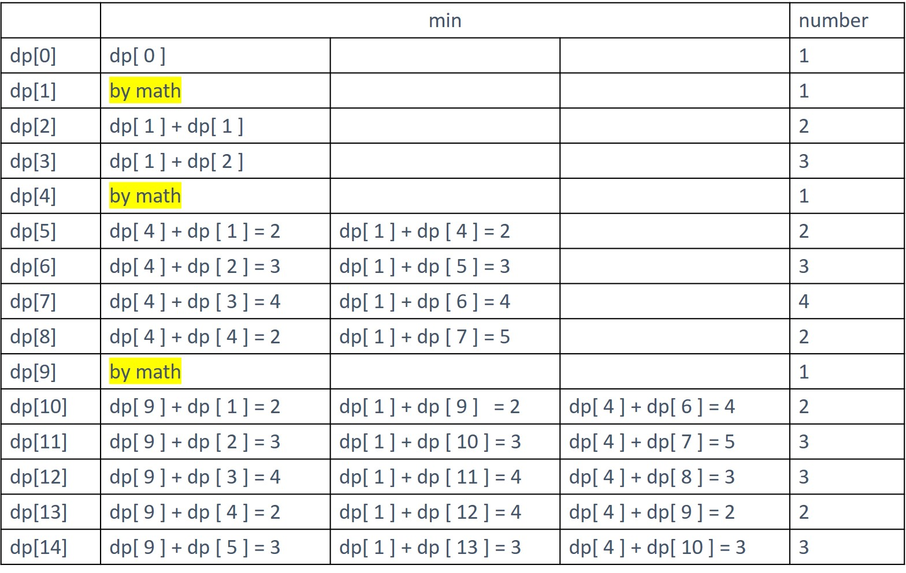

# 279. Perfect Squares
Given an integer n, return the least number of perfect square numbers that sum to n.

A perfect square is an integer that is the square of an integer; in other words, it is the product of some integer with itself. For example, 1, 4, 9, and 16 are perfect squares while 3 and 11 are not.

[LeetCode](https://leetcode.com/problems/perfect-squares)

### Example 1:

```
Input: n = 12
Output: 3
Explanation: 12 = 4 + 4 + 4.
```

### Example 2:

```
Input: n = 13
Output: 2
Explanation: 13 = 4 + 9.
```

# 完全平方數
給定正整數 n，找到若幹個完全平方數（比如 1, 4, 9, 16, ...）使得它們的和等於 n。你需要讓組成和的完全平方數的個數最少。

給你一個整數 n ，返回和為 n 的完全平方數的 最少數量 。

完全平方數 是一個整數，其值等於另一個整數的平方；換句話說，其值等於一個整數自乘的積。例如，1、4、9 和 16 都是完全平方數，而 3 和 11 不是。


## Solution  


### C
* Dynamic Programming


```
#define MIN(a, b) a > b ? b : a

int numSquares(int n)
{
  /**
   * Dynamic Programming
   * TODO: Creat an array to store result and set initial condition
   * */
  int dp[n + 1];
  dp[0] = 1;

  int squareRoot = 1;
  int square = squareRoot * squareRoot;
  
  for (int i = 1; i <= n; ++i)
  {
    if (i == square)
    {
      dp[i] = 1;
      ++squareRoot;
      square = squareRoot * squareRoot;
      continue;
    }

    int tmp = INT_MAX;
    for (int j = 1; j < squareRoot; ++j)
      tmp = MIN(tmp, dp[j * j] + dp[i - j * j]);
    dp[i] = tmp;
  }

  return dp[n];
}

int main()
{
  int res = numSquares(5);
  return 0;
}
```

### C++
* Breadth-First Searching

```
#include <queue>

using std::queue;

class Solution
{
private:
  queue<int> open;

public:
  int numSquares(int n)
  {
    /* put the target value into queue*/
    open.push(n);
    int lvNum = 1;

    while (open.empty() != true)
    {
      int lvMemNum = open.size();

      for (int i = 0; i < lvMemNum; ++i)
      {
        int tmp = open.front();
        open.pop();
        for (int j = 1; j <= tmp; ++j)
        {
          int residual = tmp - j * j;
          if (residual > 0)
            open.push(residual);
          else if(residual == 0)
            return lvNum;
          else if(residual < 0)
            break;
        }
      }
      ++lvNum;
    }
    return lvNum;
  }
};

int main()
{
  Solution test;
  int res = test.numSquares(13);

  return 0;
}
```