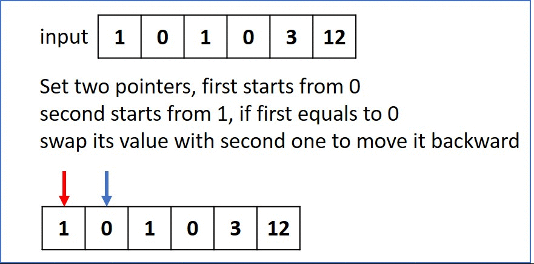

# 283. Move Zeroes
Given an array nums, write a function to move all 0's to the end of it while maintaining the relative order of the non-zero elements.

[LeetCode](https://leetcode.com/problems/move-zeroes/)

### Example :
```
Input: [0,1,0,3,12]
Output: [1,3,12,0,0]
```
### Note:
You must do this in-place without making a copy of the array.
Minimize the total number of operations.

#  移動零
給定一個數組 nums，編寫一個函數將所有 0 移動到數組的末尾，同時保持非零元素的相對順序。

### 說明：
必須在原數組上操作，不能拷貝額外的數組。
盡量減少操作次數

## Solution  
### two pointers

### C


```
void moveZeroes(int *nums, int numsSize)
{
  /**
   *  set two pointers first starts from position 0, second starts from position 1
   *  when first pointer is 0 and second not 0, swap(first, second)
   * */
  int ptrOne = 0;
  int ptrTwo = 1;

  for (; ptrTwo < numsSize; ++ptrTwo)
  {
    if (nums[ptrOne] != 0)
      ++ptrOne;

    if ((nums[ptrOne] == 0) && (nums[ptrTwo] != 0))
    {
      nums[ptrOne] = nums[ptrTwo];
      nums[ptrTwo] = 0;
      ++ptrOne;
    }
  }
}

int input[] = {0,1,0,3,12};

int main()
{

  int returnSize = 0;

  moveZeroes(input, sizeof(input) / sizeof(input[0]));

  return 0;
}
```


