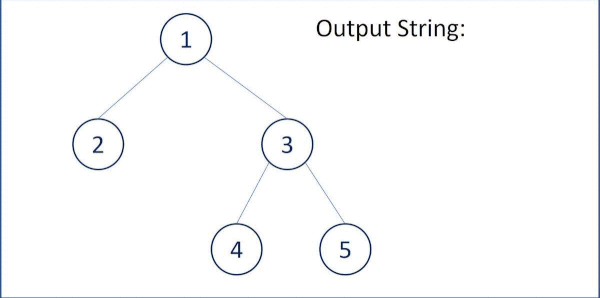

# 297. Serialize and Deserialize Binary Tree
Serialization is the process of converting a data structure or object into a sequence of bits so that it can be stored in a file or memory buffer, or transmitted across a network connection link to be reconstructed later in the same or another computer environment.

Design an algorithm to serialize and deserialize a binary tree. There is no restriction on how your serialization/deserialization algorithm should work. You just need to ensure that a binary tree can be serialized to a string and this string can be deserialized to the original tree structure.

Clarification: The input/output format is the same as how LeetCode serializes a binary tree. You do not necessarily need to follow this format, so please be creative and come up with different approaches yourself.

[LeetCode](https://leetcode.com/problems/serialize-and-deserialize-binary-tree)

### Example 1:


```
Input: root = [1,2,3,null,null,4,5]
Output: [1,2,3,null,null,4,5]
```

### Example 2:
```
Input: root = []
Output: []
```

### Example 3:
```
Input: root = [1]
Output: [1]
```
### Constraints

* The number of nodes in the tree is in the range [0, 10^4].
* -1000 <= Node.val <= 1000

#  二叉樹的序列化與反序列化

序列化是將一個數據結構或者對象轉換為連續的比特位的操作，進而可以將轉換後的數據存儲在一個文件或者內存中，同時也可以通過網絡傳輸到另一個計算機環境，采取相反方式重構得到原數據。

請設計一個算法來實現二叉樹的序列化與反序列化。這里不限定你的序列 / 反序列化算法執行邏輯，你只需要保證一個二叉樹可以被序列化為一個字符串並且將這個字符串反序列化為原始的樹結構。


## Solution  


### C++


```
#include <vector>
#include <string>

using namespace std;

/**
 * Definition for a binary tree node.*/
struct TreeNode
{
    int val;
    TreeNode *left;
    TreeNode *right;
    TreeNode() : val(0), left(nullptr), right(nullptr) {}
    TreeNode(int x) : val(x), left(nullptr), right(nullptr) {}
    TreeNode(int x, TreeNode *left, TreeNode *right) : val(x), left(left), right(right) {}
};

class Codec
{
public:
    // Encodes a tree to a single string.
    string serialize(TreeNode *root)
    {
        if (root == nullptr)
            return "-|";

        /* current node*/
        //char curr = root->val + 48;
        string curr;

        curr = to_string(root->val);
        curr += "|";
        /* left branch*/
        string left = serialize(root->left);

        /* right branch*/
        string right = serialize(root->right);

        return curr + left + right;
    }

    TreeNode *buildTree(string &data)
    {
        int endId = data.find_first_of("|");
        string valueStr = data.substr(0, endId);
        data.erase(0, endId + 1);

        if (valueStr == "-")
            return nullptr;

        int nodeVal = stoi(valueStr);

        TreeNode *curr = new TreeNode;
        curr->val = nodeVal;

        curr->left = buildTree(data);
        curr->right = buildTree(data);

        return curr;
    }

    // Decodes your encoded data to tree.
    TreeNode *deserialize(string data)
    {
        string input = data;

        TreeNode *ret = buildTree(input);

        return ret;
    }
};

int main()
{
    /* Input*/
    TreeNode B(2), D(4), E(5);
    TreeNode C(3, &D, &E);

    TreeNode A(100, &B, &C);

    /* unit test*/
    Codec ser, deser;
    string retS = ser.serialize(&A);

    TreeNode *ans = deser.deserialize(ser.serialize(&A));

    return 0;
}
```


