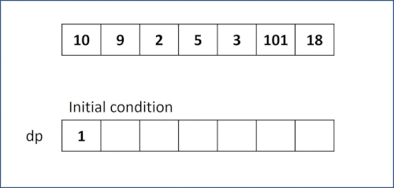

# 300. Longest Increasing Subsequence
Given an integer array nums, return the length of the longest strictly increasing subsequence.

A subsequence is a sequence that can be derived from an array by deleting some or no elements without changing the order of the remaining elements.
For example, [3,6,2,7] is a subsequence of the array [0,3,1,6,2,2,7].

[LeetCode](https://leetcode.com/problems/longest-increasing-subsequence)

### Example 1:
```
Input: nums = [10,9,2,5,3,7,101,18]
Output: 4
Explanation: The longest increasing subsequence is [2,3,7,101], therefore the length is 4.
```

### Example 2:
```
Input: nums = [0,1,0,3,2,3]
Output: 4
```

### Example 3:
```
Input: nums = [7,7,7,7,7,7,7]
Output: 1
```
### Constraints

* 1 <= nums.length <= 2500
* -10^4 <= nums[i] <= 10^4


#  最長遞增子序列
給你一個整數數組 nums ，找到其中最長嚴格遞增子序列的長度。

子序列是由數組派生而來的序列，刪除（或不刪除）數組中的元素而不改變其余元素的順序。例如，[3,6,2,7] 是數組 [0,3,1,6,2,2,7] 的子序列。


## Solution  
### Dynamic Programming

### C++

* 時間複雜度 O( n log n)

* 空間複雜度 O ( n )
```
class Solution
{
public:
    int lengthOfLIS(vector<int> &nums)
    {

        int len = nums.size();
        if (len == 1)
            return 1;

        vector<int> list;
        list.push_back(nums[0]);
        int listLen = 0;
        for (int i = 1; i < len; i++)
        {
            if (nums[i] > list.back())
            {
                list.push_back(nums[i]);
                continue;
            }
            listLen = list.size();
            int left = 0;
            int right = listLen - 1;
            int mid = 0;
            while (left < right)
            {
                mid = left + ((right - left) >> 1);
                if(list[mid] < nums[i])
                    left = mid + 1;
                else
                    right = mid;
            }
            list[left] = nums[i];
        }

        return list.size();
    }
};
```

### C


```
int lengthOfLIS(int *nums, int numsSize)
{

  /**
   * Dynamic Programming
   * TODO: creat an array to store the longest lenth at that position
   * */
  int dp[numsSize];
  int max = 1;

  /**
   * TODO: Compare value at current position nums[i] with
   *       every cell nums[j] before it.  
   *       If nums[i] > nums[j], its dp[i] value equals to dp[j] + 1
   *       Keep the maximan value
   *       dp[0] shall be set to 1 before for loop, can be remove 
   *       since when i and j both equal to 0 has the same effect. 
   * */
  int i, j;
  for (i = 0; i < numsSize; ++i)
  {
    /* Initial value of each dp[i] is 1 */
    dp[i] = 1;
    for (j = 0; j < i; ++j)
    {
      if ((nums[i] > nums[j]) && (dp[j] + 1 > dp[i]))
        dp[i] = dp[j] + 1;
      //  dp[i] = dp[j] + 1 > dp[i] ? dp[j] + 1 : dp[i];
    }
    if (dp[i] > max)
      max = dp[i];
  }
  return max;
}

int main()
{
  int nums[] = {10, 9, 2, 5, 3, 7, 101, 18};

  int res = lengthOfLIS(nums, sizeof(nums) / sizeof(nums[0]));

  return 0;
}
```


