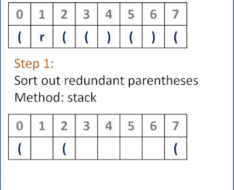

# 301. Remove Invalid Parentheses
Given a string s that contains parentheses and letters, remove the minimum number of invalid parentheses to make the input string valid.

Return all the possible results. You may return the answer in any order.

[LeetCode](https://leetcode.com/problems/remove-invalid-parentheses)

### Example 1:
```
Input: s = "()())()"
Output: ["(())()","()()()"]
```

### Example 2:
```
Input: s = "(a)())()"
Output: ["(a())()","(a)()()"]
```

### Example 3:
```
Input: s = ")("
Output: [""]
```
### Constraints

* 1 <= s.length <= 25
* s consists of lowercase English letters and parentheses '(' and ')'.
* There will be at most 20 parentheses in s.

#  刪除無效的括號

給你一個由若幹括號和字母組成的字符串 s ，刪除最小數量的無效括號，使得輸入的字符串有效。

返回所有可能的結果。答案可以按 任意順序 返回。

## Solution  
### Stack and BFS

* Shall be optimized 

### C


```
#include <string>
#include <unordered_set>
#include <stack>
#include <vector>
#include <algorithm>
#include <queue>

using namespace std;

#define LEFTPAR '('
#define RIGHTPAR ')'

class Solution
{
private:
    stack<pair<char, int>> pile;
    vector<int> leftMap;
    vector<int> rightMap;

    int stringLen{0};

    void filterParenthesis(string &s)
    {
        for (int i = 0; i < stringLen; ++i)
        {
            char symbol = s.at(i);
            /* record parentheses position separetely*/
            if (symbol == LEFTPAR)
                leftMap.push_back(i);
            else if (symbol == RIGHTPAR)
                rightMap.push_back(i);

            /* filter out the redundant parentheses*/
            if (symbol == LEFTPAR || symbol == RIGHTPAR)
            {
                /* put the first parenthesis into stack*/
                if (pile.empty() == true)
                {
                    pile.emplace(make_pair(symbol, i));
                    continue;
                }

                /* if top can be paired,  pop*/
                char topSymbol = pile.top().first;
                if (symbol == RIGHTPAR && topSymbol == LEFTPAR)
                    pile.pop();
                else
                    pile.emplace(make_pair(symbol, i));
            }
            /* what stays in stake is the redundent parentheses*/
        }
    }

public:
    vector<string> removeInvalidParentheses(string s)
    {
        stringLen = s.size();

        filterParenthesis(s);

        /* if no redundant parentheses need to be removed*/
        if (pile.empty() == true)
        {
            vector<string> ret;
            ret.emplace_back(s);
            return ret;
        }

        /* select position to be removed*/
        vector<int> leftRedundant;
        vector<int> rightRedundant;
        vector<vector<int>> candidate;
        vector<int> candidateLen;

        while (pile.empty() != true)
        {
            pair<char, int> tmp = pile.top();
            pile.pop();

            if (tmp.first == RIGHTPAR)
                rightRedundant.push_back(tmp.second);
            else
                leftRedundant.push_back(tmp.second);
        }

        /* possible position to delete*/
        vector<int> tmpList;

        reverse(rightRedundant.begin(), rightRedundant.end());
        int thr = 0;
        int endHere = 0;
        int duplicated = 0;
        for (const int &right : rightRedundant)
        {
            for (const int &possiblePos : rightMap)
            {
                if (possiblePos <= right)
                    tmpList.push_back(possiblePos);
                else
                    break;
            }
            candidate.emplace_back(tmpList);
            candidateLen.push_back(tmpList.size() - duplicated);
            duplicated++;
            tmpList.clear();
        }

        /* possible position to delete for left parenthesis*/
        reverse(leftMap.begin(), leftMap.end());
         duplicated = 0;
        for (const int &left : leftRedundant)
        {
            for (const int &possiblePos : leftMap)
            {
                if (possiblePos >= left)
                    tmpList.push_back(possiblePos);
                else
                    break;
            }
            candidate.emplace_back(tmpList);

            candidateLen.push_back(tmpList.size() - duplicated);
            duplicated++;

            tmpList.clear();
        }

        /* BFS*/
        queue<string> bfs;
        bfs.push(s);
        int lastLv = -1;
        int thisLv = 0;
        int levelLen = 1;
        int counter = 0;
        while (bfs.empty() != true)
        {
            string front = bfs.front();
            bfs.pop();

            if (lastLv != thisLv)
            {
                levelLen *= candidateLen[thisLv];
                ++lastLv;
            }

            for (const auto &i : candidate[thisLv])
            {
                string tmpString = front;
                if (front.at(i) == '-')
                    continue;
                tmpString.replace(i, 1, "-");
                bfs.push(tmpString);
                counter++;
            }

            if (counter == levelLen)
            {
                thisLv++;
                counter = 0;
            }

            if (thisLv == candidate.size())
                break;
        }

        /* delete - from string*/
        unordered_set<string> set;

        vector<string> ret;
        while (bfs.empty() != true)
        {
            string tmpString = bfs.front();
            bfs.pop();
            string output;
            for (const char c : tmpString)
            {
                if (c != '-')
                    output += c;
            }

            if (set.count(output) == 0)
                ret.emplace_back(output);

            set.insert(output);
        }

        return ret;
    }
};

int main()
{
    /* Input*/
    string input = ")(";

    /* unit test*/
    Solution test;
    vector<string> res = test.removeInvalidParentheses(input);

    return 0;
}
```


