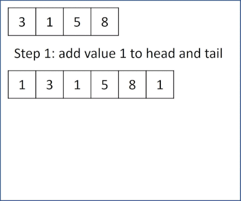

# 312. Burst Balloons
You are given n balloons, indexed from 0 to n - 1. Each balloon is painted with a number on it represented by an array nums. You are asked to burst all the balloons.

If you burst the ith balloon, you will get nums[i - 1] * nums[i] * nums[i + 1] coins. If i - 1 or i + 1 goes out of bounds of the array, then treat it as if there is a balloon with a 1 painted on it.

Return the maximum coins you can collect by bursting the balloons wisely.

[LeetCode](https://leetcode.com/problems/burst-balloons)

### Example 1:

```
Input: nums = [3,1,5,8]
Output: 167
Explanation:
nums = [3,1,5,8] --> [3,5,8] --> [3,8] --> [8] --> []
coins =  3*1*5    +   3*5*8   +  1*3*8  + 1*8*1 = 167
```

### Example 2:
```
Input: nums = [1,5]
Output: 10
```

### Constraints

* n == nums.length
* 1 <= n <= 500
* 0 <= nums[i] <= 100

#  戳氣球

有 n 個氣球，編號為0 到 n - 1，每個氣球上都標有一個數字，這些數字存在數組 nums 中。

現在要求你戳破所有的氣球。戳破第 i 個氣球，你可以獲得 nums[i - 1] * nums[i] * nums[i + 1] 枚硬幣。 這里的 i - 1 和 i + 1 代表和 i 相鄰的兩個氣球的序號。如果 i - 1或 i + 1 超出了數組的邊界，那麽就當它是一個數字為 1 的氣球。

求所能獲得硬幣的最大數量。

## Solution  
* recursion  

### C++



```
#include <vector>

using namespace std;

class Solution
{
private:
    vector<vector<int>> score;
    vector<int> extendNums;

    int sectorMax(int left, int right)
    {
        if (left >= right - 1)
            return 0;

        if (score[left][right] != -1)
            return score[left][right];

        int tmpSum = 0;
        for (int i = left + 1; i < right; ++i)
        {
            tmpSum = extendNums[left] * extendNums[i] * extendNums[right];
            tmpSum += (sectorMax(left, i) + sectorMax(i, right));
            score[left][right] = score[left][right] > tmpSum ? score[left][right] : tmpSum;
        }

        return score[left][right];
    }

public:
    int maxCoins(vector<int> &nums)
    {
        /* add value:1 to front and back */

        extendNums.push_back(1);
        for (const auto &i : nums)
            extendNums.push_back(i);
        extendNums.push_back(1);

        int inputLen = extendNums.size();
        score.resize(inputLen, vector<int>(inputLen, -1));

        /* calculate sum in range[left][right]*/
        sectorMax(0, inputLen - 1);

        return score[0][inputLen - 1];
    }
};

int main()
{
    /* Input*/
    vector<int> input = {3,1,5,8};

    /* unit test*/
    Solution test;
    int res = test.maxCoins(input);

    return 0;
}

```


