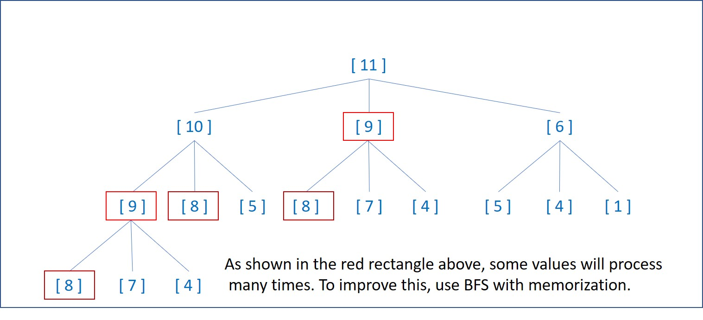

# 322. Coin Change
You are given an integer array coins representing coins of different denominations and an integer amount representing a total amount of money.

Return the fewest number of coins that you need to make up that amount. If that amount of money cannot be made up by any combination of the coins, return -1.

You may assume that you have an infinite number of each kind of coin.

[LeetCode](https://leetcode.com/problems/coin-change)

### Example 1:
```
Input: coins = [1,2,5], amount = 11
Output: 3
Explanation: 11 = 5 + 5 + 1
```

### Example 2:
```
Input: coins = [2], amount = 3
Output: -1
```

### Example 3:
```
Input: coins = [1], amount = 0
Output: 0
```

#  零錢兌換
給定不同面額的硬幣 coins 和一個總金額 amount。編寫一個函數來計算可以湊成總金額所需的最少的硬幣個數。如果沒有任何一種硬幣組合能組成總金額，返回 -1。

你可以認為每種硬幣的數量是無限的。


## Solution  
### BFS with Memorization


### C++

```
#include <vector>
#include <queue>

using namespace std;

class Solution
{
public:
  int coinChange(vector<int> &coins, int amount)
  {
    if (amount == 0)
      return 0;
    /**
     * TODO: BFS Algorithm
     *       lv number equals to how many digits in the level
     **/

    /* initial state*/
    queue<int> open;
    open.push(amount);

    vector<bool> visted(amount + 1, false);
    visted[amount] = true;

    int lv = 1; /* This algorithm starts adding member to lv 1*/
    int lvMemNum;
    int coinSize = coins.size();
    int i, j, tmp, residual;

    while (open.empty() != true)
    {
      lvMemNum = open.size();

      for (i = 0; i < lvMemNum; ++i)
      {
        tmp = open.front();
        open.pop();
        for (j = 0; j < coinSize; j++)
        {
          residual = tmp - coins[j];
          if (residual == 0)
            return lv;
          else if (residual > 0 && visted[residual] != true)
          {
            open.push(residual);
            visted[residual] = true;
          }
        }
      }
      ++lv;
    }

    return -1;
  }
};

int main()
{
  vector<int> nums{1, 2, 5};

  Solution test;

  int res = test.coinChange(nums, 11);

  return 0;
}
```


