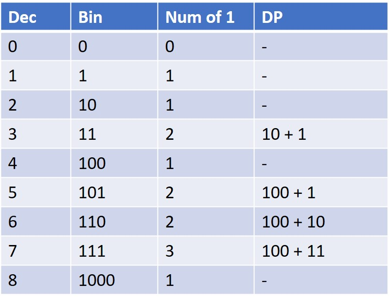

# 338. Counting Bits
Given an integer num, return an array of the number of 1's in the binary representation of every number in the range [0, num].

[LeetCode](https://leetcode.com/problems/counting-bits)

### Example 1:

```
Input: num = 2
Output: [0,1,1]
Explanation:
0 --> 0
1 --> 1
2 --> 10
```

### Example 2:

```
Input: num = 5
Output: [0,1,1,2,1,2]
Explanation:
0 --> 0
1 --> 1
2 --> 10
3 --> 11
4 --> 100
5 --> 101

```

#  比特位計數
給定一個非負整數 num。對於 0 ≤ i ≤ num 範圍中的每個數字 i ，計算其二進制數中的 1 的數目並將它們作為數組返回。


## Solution  
### Dynamic Programming


### C

```
int *countBits(int num, int *returnSize)
{
  /* initialization */
  *returnSize = num + 1;
  int *ret = (int *)malloc(sizeof(int) * (*returnSize));

  /* Dynamic Programming boundary condition*/

  ret[0] = 0;
  if (num > 0)
    ret[1] = 1;

  int powerTwo = 2;
  int prePowerTwo;

  /* start of Dynammic Programming */
  for (int i = 2; i <= num; ++i)
  {
    if (i == powerTwo)
    {
      ret[i] = 1;
      prePowerTwo = powerTwo;
      powerTwo *= 2;
    }
    else
      ret[i] = ret[prePowerTwo] + ret[i - prePowerTwo];
  }

  return ret;
}

int main()
{
  int returnSize = 0;

  /* Algorithm*/
  int *res = countBits(8, &returnSize);
  
  printf("[ ");
  for(int i = 0; i < returnSize; ++i)
  {
    printf("%i ", res[i]);
  }
  printf("]\n");

  return 0;
}
```
### Odd Even number

### C
int *countBits(int num, int *returnSize)
{
  /* initialization */
  *returnSize = num + 1;
  int *ret = (int *)malloc(sizeof(int) * (*returnSize));

  /* Dynamic Programming boundary condition*/

  ret[0] = 0;

  /* start of Dynammic Programming */
  for (int i = 1; i <= num; ++i)
  {
    if (i % 2 == 1)
      ret[i] = ret[i-1] + 1;
    else
      ret[i] = ret[i/2];
  }

  return ret;
}

int main()
{
  int returnSize = 0;

  /* Algorithm*/
  int *res = countBits(8, &returnSize);

  printf("[ ");
  for (int i = 0; i < returnSize; ++i)
  {
    printf("%i ", res[i]);
  }
  printf("]\n");

  return 0;
}
