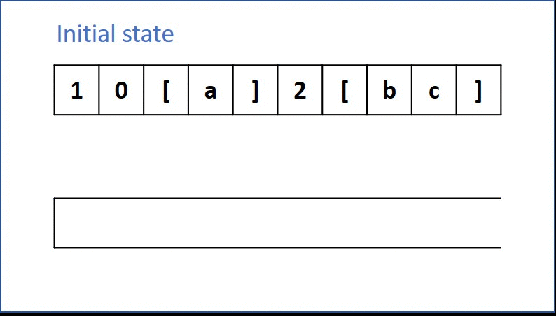

# 394. Decode String
Given an encoded string, return its decoded string.

The encoding rule is: k[encoded_string], where the encoded_string inside the square brackets is being repeated exactly k times. Note that k is guaranteed to be a positive integer.

You may assume that the input string is always valid; No extra white spaces, square brackets are well-formed, etc.

Furthermore, you may assume that the original data does not contain any digits and that digits are only for those repeat numbers, k. For example, there won't be input like 3a or 2[4].

[LeetCode](https://leetcode.com/problems/decode-string)

### Example 1:

```
Input: s = "3[a]2[bc]"
Output: "aaabcbc"
```

### Example 2:

```
Input: s = "3[a]2[bc]"
Output: "aaabcbc"
```

### Example 3:
```
Input: s = "3[a]2[bc]"
Output: "aaabcbc"
```

#  字符串解碼
給定一個經過編碼的字符串，返回它解碼後的字符串。

編碼規則為: k[encoded_string]，表示其中方括號內部的 encoded_string 正好重覆 k 次。注意 k 保證為正整數。

你可以認為輸入字符串總是有效的；輸入字符串中沒有額外的空格，且輸入的方括號總是符合格式要求的。

此外，你可以認為原始數據不包含數字，所有的數字只表示重覆的次數 k ，例如不會出現像 3a 或 2[4] 的輸入。


## Solution  

### stack


### C++

```
#include <string>
#include <stack>
#include <algorithm>

using namespace std;

#define READ_DIGIT 0
#define READ_LETTER 1
#define DECODE 2

class Solution
{
private:
    stack<string> tmpStack;

public:
    string decodeString(string s)
    {
        string tmpDigits = "";
        string tmpLetter = "";
        string tmpDecode = "";

        unsigned char state = s[0] <= 57 ? READ_DIGIT : READ_LETTER;
        unsigned char lastState;

        for (const auto &c : s)
        {
            lastState = state;
            switch (state)
            {
            case READ_DIGIT:
                if (c > 57)
                    state = READ_LETTER;
                break;

            case READ_LETTER:
                if (c <= 57)
                    state = READ_DIGIT;
                else if (c == ']')
                    state = DECODE;
                break;

            case DECODE:
                if (c <= 57)
                    state = READ_DIGIT;
                else if (c >= 97)
                    state = READ_LETTER;
                break;
            }

            switch (state)
            {
            case READ_DIGIT:
                tmpDigits += c;
                break;

            case READ_LETTER:
                if (lastState == READ_DIGIT)
                {
                    tmpStack.emplace(tmpDigits);
                    tmpDigits = "";
                }
                tmpLetter = c;
                tmpStack.emplace(tmpLetter);
                break;

            case DECODE:
                while (tmpStack.top() != "[")
                {
                    tmpDecode += tmpStack.top();
                    tmpStack.pop();
                }
                tmpStack.pop(); /* remove "["*/

                int repeat = stoi(tmpStack.top());
                tmpStack.pop();
                for (int i = 0; i < repeat; ++i)
                {
                    tmpStack.emplace(tmpDecode);
                }
                tmpDecode = "";
                break;
            }
        }

        /* Decode process is over, dump stack to strings*/ 

        while (tmpStack.empty() != true)
        {
            tmpDecode += tmpStack.top();
            tmpStack.pop();
        }

        reverse(tmpDecode.begin(), tmpDecode.end());

        return tmpDecode;
    }
};

int main()
{

    string input = "3[a2[c]]";

    Solution test;

    string res = test.decodeString(input);

    return 0;
}
```