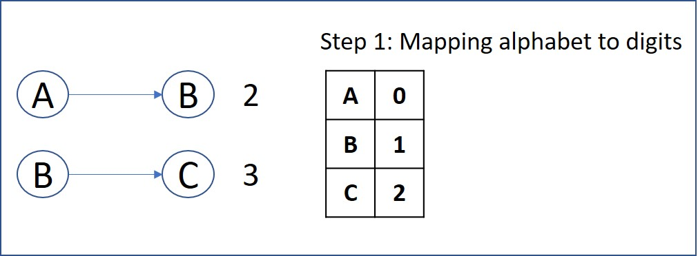

# 399. Evaluate Division
You are given an array of variable pairs equations and an array of real numbers values, where equations[i] = [Ai, Bi] and values[i] represent the equation Ai / Bi = values[i]. Each Ai or Bi is a string that represents a single variable.

You are also given some queries, where queries[j] = [Cj, Dj] represents the jth query where you must find the answer for Cj / Dj = ?.

Return the answers to all queries. If a single answer cannot be determined, return -1.0.

Note: The input is always valid. You may assume that evaluating the queries will not result in division by zero and that there is no contradiction.


[LeetCode](https://leetcode.com/problems/evaluate-division)

### Example 1:

```
Input: equations = [["a","b"],["b","c"]], values = [2.0,3.0], queries = [["a","c"],["b","a"],["a","e"],["a","a"],["x","x"]]
Output: [6.00000,0.50000,-1.00000,1.00000,-1.00000]
Explanation: 
Given: a / b = 2.0, b / c = 3.0
queries are: a / c = ?, b / a = ?, a / e = ?, a / a = ?, x / x = ?
return: [6.0, 0.5, -1.0, 1.0, -1.0 ]

```

### Example 2:

```
Input: equations = [["a","b"],["b","c"],["bc","cd"]], values = [1.5,2.5,5.0], queries = [["a","c"],["c","b"],["bc","cd"],["cd","bc"]]
Output: [3.75000,0.40000,5.00000,0.20000]
```

### Example 3:
```
Input: equations = [["a","b"]], values = [0.5], queries = [["a","b"],["b","a"],["a","c"],["x","y"]]
Output: [0.50000,2.00000,-1.00000,-1.00000]
```

### Constraints
* 1 <= equations.length <= 20
* equations[i].length == 2
* 1 <= Ai.length, Bi.length <= 5
* values.length == equations.length
* 0.0 < values[i] <= 20.0
* 1 <= queries.length <= 20
* queries[i].length == 2
* 1 <= Cj.length, Dj.length <= 5
* Ai, Bi, Cj, Dj consist of lower case English letters and digits.


#  除法求值
給你一個變量對數組 equations 和一個實數值數組 values 作為已知條件，其中 equations[i] = [Ai, Bi] 和 values[i] 共同表示等式 Ai / Bi = values[i] 。每個 Ai 或 Bi 是一個表示單個變量的字符串。

另有一些以數組 queries 表示的問題，其中 queries[j] = [Cj, Dj] 表示第 j 個問題，請你根據已知條件找出 Cj / Dj = ? 的結果作為答案。

返回 所有問題的答案 。如果存在某個無法確定的答案，則用 -1.0 替代這個答案。如果問題中出現了給定的已知條件中沒有出現的字符串，也需要用 -1.0 替代這個答案。

注意：輸入總是有效的。你可以假設除法運算中不會出現除數為 0 的情況，且不存在任何矛盾的結果。


## Solution  
1. Mapping alphabet to digits


2. Built the routes and weights


3. Depth first search 

### C++ BFS
```
class Solution
{
public:
    vector<double> calcEquation(vector<vector<string>> &equations, vector<double> &values, vector<vector<string>> &queries)
    {
        int len = equations.size();
        int queryLen = queries.size();
        vector<double> ret(queryLen, -1.0);
        /*build map*/
        unordered_map<string, vector<pair<string, double>>> routeMap;
        for (int i = 0; i < len; i++)
        {
            pair<string, double> next = make_pair(equations[i][1], values[i]);
            pair<string, double> reverse = make_pair(equations[i][0], 1 / values[i]);
            routeMap[equations[i][0]].push_back(next);
            routeMap[equations[i][1]].push_back(reverse);
        }

        /* find the path from start to target*/
        for(int i = 0; i < queryLen; ++i)
        {
            vector<string> query = queries[i];
        
            string target = query[1];
            pair<string, double> start = make_pair(query[0], 1.0);

            queue<pair<string, double>> frontier;
            unordered_set<string> visted;

            /* use breadth first search to find the route between start and target*/
            frontier.push(start);
            bool found = false;
            while (frontier.empty() != true && found == false)
            {
                pair<string, double> temp = frontier.front();
                frontier.pop();
                visted.insert(temp.first);
                /* next possible point*/
                for (const pair<string, double> &next : routeMap[temp.first])
                {
                    if(next.first == target)   
                    { 
                        ret[i] = temp.second* next.second;
                        found = true;
                        break;
                    }

                    if (visted.find(next.first) == visted.end()) /* theis next have not been visted*/
                    {
                        frontier.push(make_pair(next.first, temp.second* next.second));
                    }
                }
            }
        }

        return ret;
    }
};

int main()
{
    vector<vector<string>> equations = {{"a", "b"}, {"b", "c"}, {"bc", "cd"}};
    vector<double> values = {2.0, 3.0, 5.0};
    vector<vector<string>> queries = {{"a", "c"}, {"bc", "cd"}};

    Solution test;
    vector<double> res = test.calcEquation(equations, values, queries);

    return 0;
}
```

### C++ DFS

```
#include <string>
#include <vector>
#include <unordered_map>
#include <stack>

using namespace std;

class Solution
{
private:
    int totalValNum{0};
    unordered_map<string, int> idMap;
    vector<vector<pair<int, double>>> weightMap;
    vector<double> ret;

    void buildIdMap(vector<vector<string>> &equations)
    {
        for (const auto &row : equations)
        {
            for (const auto &letter : row)
            {
                if (idMap.count(letter) == 0)
                    idMap[letter] = totalValNum++;
            }
        }
    }

    void buildWeightMap(vector<vector<string>> &equations, vector<double> &values)
    {
        int startId;
        int endId;
        double weight;
        weightMap.resize(totalValNum);
        for (int i = 0; i < values.size(); i++)
        {
            startId = idMap[equations[i][0]];
            endId = idMap[equations[i][1]];
            weight = values[i];

            weightMap[startId].push_back(make_pair(endId, weight));
            /* built the opsite relation*/
            weightMap[endId].push_back(make_pair(startId, 1.0 / weight));
        }
    }

    void depthFristSearch(const int &startId, const int &endId)
    {
        vector<bool> visted(totalValNum, false);
        vector<int> trace(totalValNum, -1); /* for debug*/
        vector<double> ratio(totalValNum, -1.0);
        ratio[startId] = 1.0;
        bool found = false;

        stack<int> open;
        open.push(startId);

        /**
                     *  trace record the link in this loop
                     *  for example trace = {-1, 0, 1}
                     *  trace[2] comes form 1
                     *  trace[1] comes from 0
                     * */

        while (open.empty() != true)
        {
            int tmp = open.top();
            open.pop();
            visted[tmp] = true;

            if (tmp == endId)
            {
                found = true;
                ret.push_back(ratio[endId]);
                break;
            }

            for (const auto &nextPt : weightMap[tmp])
            {
                if (visted[nextPt.first] != true)
                {
                    visted[nextPt.first] = true;
                    trace[nextPt.first] = tmp;
                    ratio[nextPt.first] = ratio[tmp] * nextPt.second;
                    open.push(nextPt.first);
                }
            }
        }
        if (found != true)
            ret.push_back(-1.0);
    }

public:
    vector<double> calcEquation(vector<vector<string>> &equations, vector<double> &values, vector<vector<string>> &queries)
    {

        /* step 1: Mapping alphabet to digits */
        buildIdMap(equations);

        /* step 2: build the weight map*/

        buildWeightMap(equations, values);

        /* Step 3: Process queries */

        for (const auto &query : queries)
        {
            if ((idMap.count(query[0]) != 0) && (idMap.count(query[1]) != 0))
            {
                int startId = idMap[query[0]];
                int endId = idMap[query[1]];

                /* Spceial cases that can skip DFS algorithm*/
                if (startId == endId)
                    ret.push_back(1.0);
                else /* Step 4: Performing DFS */
                    depthFristSearch(startId, endId);
            }
            else
                ret.push_back(-1.0);
        }
        return ret;
    }
};

int main()
{
    vector<vector<string>> equations = {{"a", "b"}, {"b", "c"}, {"bc", "cd"}};
    vector<double> values = {2.0, 3.0, 5.0};
    vector<vector<string>> queries = {{"a", "c"}, {"bc", "cd"}};

    Solution test;
    vector<double> res = test.calcEquation(equations, values, queries);

    return 0;
}
```