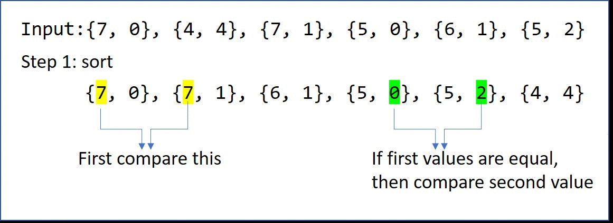

# 406. Queue Reconstruction by Height
You are given an array of people, people, which are the attributes of some people in a queue (not necessarily in order). Each people[i] = [hi, ki] represents the ith person of height hi with exactly ki other people in front who have a height greater than or equal to hi.

Reconstruct and return the queue that is represented by the input array people. The returned queue should be formatted as an array queue, where queue[j] = [hj, kj] is the attributes of the jth person in the queue (queue[0] is the person at the front of the queue).

[LeetCode](https://leetcode.com/problems/queue-reconstruction-by-height)

### Example 1:

```
Input: people = [[7,0],[4,4],[7,1],[5,0],[6,1],[5,2]]
Output: [[5,0],[7,0],[5,2],[6,1],[4,4],[7,1]]
Explanation:
Person 0 has height 5 with no other people taller or the same height in front.
Person 1 has height 7 with no other people taller or the same height in front.
Person 2 has height 5 with two persons taller or the same height in front, which is person 0 and 1.
Person 3 has height 6 with one person taller or the same height in front, which is person 1.
Person 4 has height 4 with four people taller or the same height in front, which are people 0, 1, 2, and 3.
Person 5 has height 7 with one person taller or the same height in front, which is person 1.
Hence [[5,0],[7,0],[5,2],[6,1],[4,4],[7,1]] is the reconstructed queue.
```

### Example 2:

```
Input: people = [[6,0],[5,0],[4,0],[3,2],[2,2],[1,4]]
Output: [[4,0],[5,0],[2,2],[3,2],[1,4],[6,0]]
```

### Constraints:

* 1 <= people.length <= 2000
* 0 <= hi <= 10^6
* 0 <= ki < people.length
* It is guaranteed that the queue can be reconstructed.

#  根據身高重建隊列
假設有打亂順序的一群人站成一個隊列，數組 people 表示隊列中一些人的屬性（不一定按順序）。每個 people[i] = [hi, ki] 表示第 i 個人的身高為 hi ，
前面 正好 有 ki 個身高大於或等於 hi 的人。

請你重新構造並返回輸入數組 people 所表示的隊列。返回的隊列應該格式化為數組 queue ，其中 queue[j] = [hj, kj]
是隊列中第 j 個人的屬性（queue[0] 是排在隊列前面的人）。


## Solution  



### C++
```
#include <vector>
#include <algorithm>

using namespace std;

class Solution
{
private:
    static bool cmp(const vector<int> a, const vector<int> b)
    {
        if (a[0] == b[0])
            return a[1] < b[1];
        return a[0] > b[0];
    }

public:
    vector<vector<int>> reconstructQueue(vector<vector<int>> &people)
    {
        sort(people.begin(), people.end(), cmp);

        vector<vector<int>> ret;
        int retLen;

        for (const auto &member : people)
        {
            retLen = ret.size();
            if(member[1] >= retLen) 
                ret.push_back(member);
            else
                ret.insert(ret.begin()+member[1], member);
        }

        return ret;
    }
};

int main()
{

    vector<vector<int>> people = {{7, 0}, {4, 4}, {7, 1}, {5, 0}, {6, 1}, {5, 2}};

    Solution test;
    vector<vector<int>> res = test.reconstructQueue(people);

    return 0;
}
```