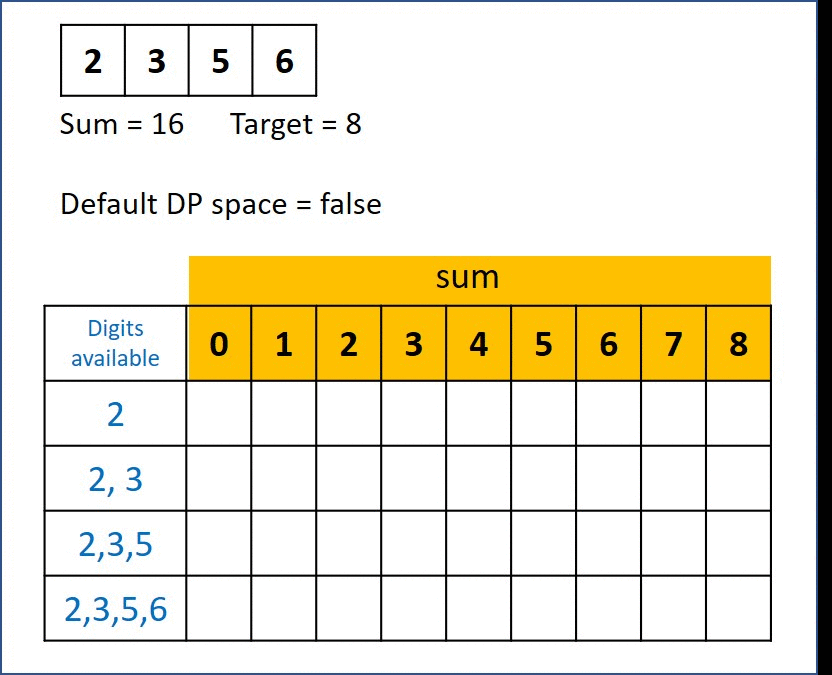

# 416. Partition Equal Subset Sum
Given a non-empty array nums containing only positive integers, find if the array can be partitioned into two subsets such that the sum of elements in both subsets is equal.

[LeetCode](https://leetcode.com/problems/partition-equal-subset-sum)

### Example 1:

```
Input: nums = [1,5,11,5]
Output: true
Explanation: The array can be partitioned as [1, 5, 5] and [11].
```

### Example 2:

```
Input: nums = [1,2,3,5]
Output: false
Explanation: The array cannot be partitioned into equal sum subsets.
```

#  分割等和子集
給你一個 只包含正整數 的 非空 數組 nums 。請你判斷是否可以將這個數組分割成兩個子集，使得兩個子集的元素和相等。

## Solution  
Dynammic Programming


### C

```
# include <string.h>

typedef int bool;
enum
{
    false,
    true
};

bool canPartition(int *nums, int numsSize)
{
    bool ret = false;
    if (numsSize <= 1)
        return false;

    int sum = 0;
    int max = 0;
    for (int i = 0; i < numsSize; ++i)
    {
        sum += nums[i];
        if (nums[i] > max)
            max = nums[i];
    }

    int target = sum / 2;

    if (sum % 2 == 1)
        return false;
    else if (max > target)
        return false;
    else
    {
        /* Dynamic Programming*/
        int target = sum / 2;
        bool dp[numsSize][target + 1];

        /* initialize dp matrix */
        memset(dp, 0, sizeof(dp));
        int i; /* row*/
        int j; /* column*/

        /* set boundary condition for 1st column*/
        for (i = 0; i < numsSize; ++i)
            dp[i][0] = true;

        /* set boundary conditoin for 1 row */
        dp[0][nums[0]] = true;

        for (i = 1; i < numsSize; ++i)
        {
            for (j = 1; j < target + 1; ++j)
            {
                if (j >= nums[i])
                    dp[i][j] = dp[i - 1][j] || dp[i - 1][j - nums[i]];
                else
                    dp[i][j] = dp[i - 1][j];
            }
            if (dp[i][target] == true)
                return true;
        }
    }

    return false;
}

int main()
{
    int nums[] = {2, 3, 5, 6};
    bool res = canPartition(nums, sizeof(nums) / sizeof(nums[0]));

    return 0;
}
```