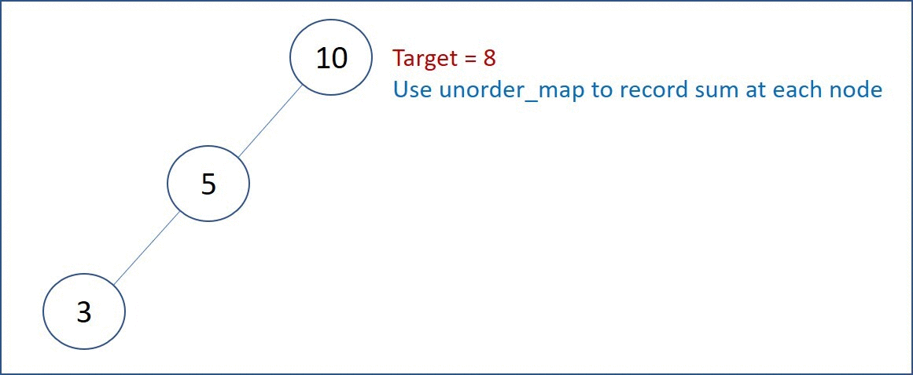

# 437. Path Sum III
Given the root of a binary tree and an integer targetSum, return the number of paths where the sum of the values along the path equals targetSum.

The path does not need to start or end at the root or a leaf, but it must go downwards (i.e., traveling only from parent nodes to child nodes).

[LeetCode](https://leetcode.com/problems/path-sum-iii)

### Example 1:


```
Input: root = [10,5,-3,3,2,null,11,3,-2,null,1], targetSum = 8
Output: 3
Explanation: The paths that sum to 8 are shown.
```

### Example 2:

```
Input: root = [5,4,8,11,null,13,4,7,2,null,null,5,1], targetSum = 22
Output: 3
```
### Constraints:

* The number of nodes in the tree is in the range [0, 1000].
* -10^9 <= Node.val <= 10^9
* -1000 <= targetSum <= 1000

#  路徑總合 III
給定一個二叉樹，它的每個結點都存放著一個整數值。

找出路徑和等於給定數值的路徑總數。

路徑不需要從根節點開始，也不需要在葉子節點結束，但是路徑方向必須是向下的（只能從父節點到子節點）。

二叉樹不超過1000個節點，且節點數值範圍是 [-1000000,1000000] 的整數。

## Solution  
Dynammic Programming


### C++

```
#include <unordered_map>

using namespace std;

/*Definition for a binary tree node.*/
struct TreeNode
{
    int val;
    TreeNode *left;
    TreeNode *right;
    TreeNode() : val(0), left(nullptr), right(nullptr) {}
    TreeNode(int x) : val(x), left(nullptr), right(nullptr) {}
    TreeNode(int x, TreeNode *left, TreeNode *right) : val(x), left(left), right(right) {}
};

class Solution
{

private:
    unordered_map<int, int> prefixMap;

    void DFS(TreeNode *root, const int &prefix, const int &target, int &ret)
    {
        if (root == nullptr)
            return;

        /* update current node info*/
        int currPrefix = root->val + prefix;

        /* search in the history map, see if request values exist*/
        if (prefixMap.count(currPrefix - target) != 0)
            ret += prefixMap[currPrefix - target];

        /* record current prefix in the map*/
        prefixMap[currPrefix]++;

        /* Depth first search: left first*/
        DFS(root->left, currPrefix, target, ret);
        DFS(root->right, currPrefix, target, ret);

        prefixMap[currPrefix]--;
    }

public:
    int pathSum(TreeNode *root, int targetSum)
    {
        int ret = 0;
        /* set prefixMap[0] to 1 for case in which the root itself can fulfill the requirement*/
        prefixMap[0] = 1;
        DFS(root, 0, targetSum, ret);

        return ret;
    }
};

int main()
{
    TreeNode J(3);
    TreeNode G(3, &J, nullptr);
    TreeNode H(-2);
    TreeNode D(3, &G, &H);
    TreeNode I(1);
    TreeNode E(2, nullptr, &I);
    TreeNode B(5, &D, &E);
    TreeNode F(11);
    TreeNode C(-3, nullptr, &F);
    TreeNode A(10, &B, &C);    

    Solution test;
    test.pathSum(&A, 0);

    return 0;
}
```