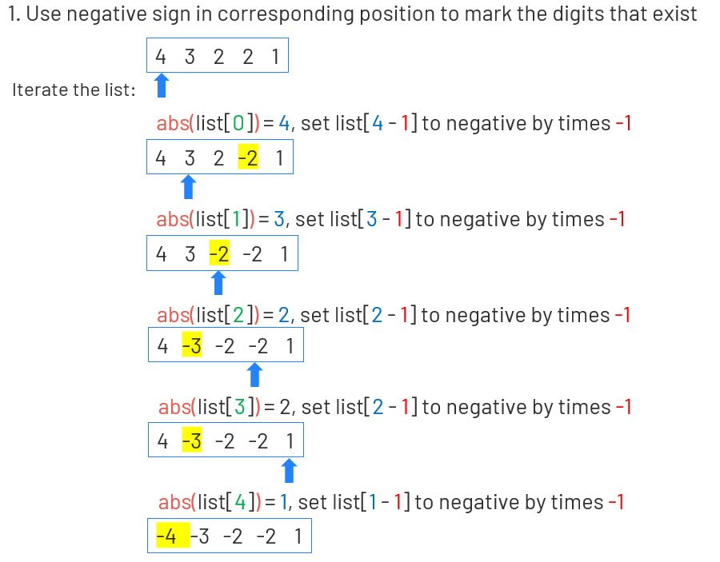

# 448. Find All Numbers Disappeared in an Array
Given an array of integers where 1 ≤ a[i] ≤ n (n = size of array), some elements appear twice and others appear once.

Find all the elements of [1, n] inclusive that do not appear in this array.

Could you do it without extra space and in O(n) runtime? You may assume the returned list does not count as extra space.

[LeetCode](https://leetcode.com/problems/find-all-numbers-disappeared-in-an-array/)

### Example :
```
Input:
[4,3,2,7,8,2,3,1]

Output:
[5,6]
```

##  找到所有數組中消失的數字
給定一個範圍在  1 ≤ a[i] ≤ n ( n = 數組大小 ) 的 整型數組，數組中的元素一些出現了兩次，另一些只出現一次。

找到所有在 [1, n] 範圍之間沒有出現在數組中的數字。

您能在不使用額外空間且時間覆雜度為O(n)的情況下完成這個任務嗎? 你可以假定返回的數組不算在額外空間內


## Solution  


### C

```
int *findDisappearedNumbers(int *nums, int numsSize, int *returnSize)
{
    int i = 0;
    int j = 0;
    *returnSize = 0;

    for (i = 0; i < numsSize; i++)
    {
        nums[abs(nums[i]) - 1] = abs(nums[abs(nums[i]) - 1]) * -1;
    }

    for (i = 0; i < numsSize; i++)
    {
        if (nums[i] > 0)
        {
            (*returnSize)++;
            nums[j] = i + 1;
            j++;
        }
    }

    return nums;
}
```


