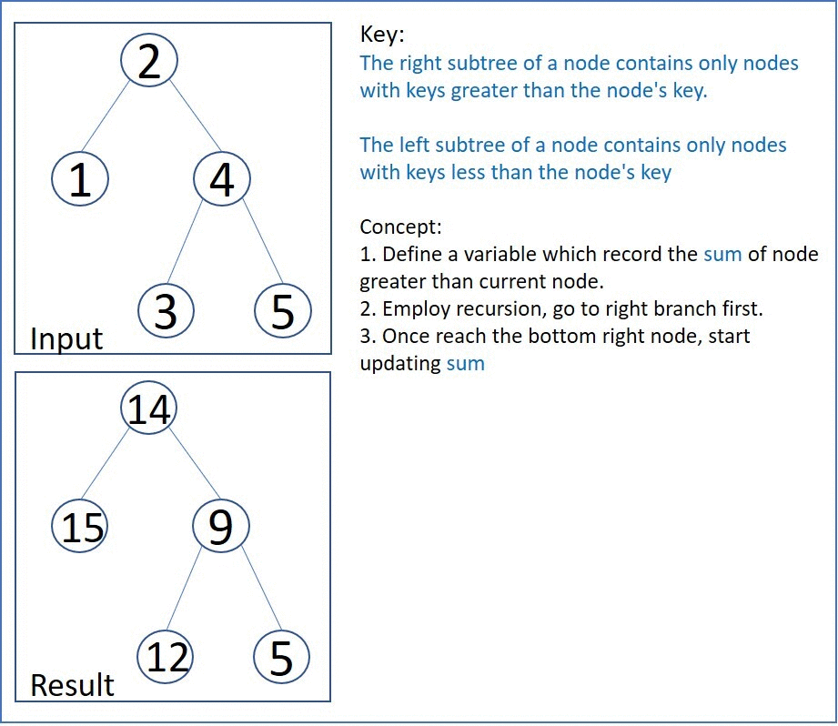

# 538. Convert BST to Greater Tree
Given the root of a Binary Search Tree (BST), convert it to a Greater Tree such that every key of the original BST is changed to the original key plus sum of all keys greater than the original key in BST.

As a reminder, a binary search tree is a tree that satisfies these constraints:

* The left subtree of a node contains only nodes with keys less than the node's key.
* The right subtree of a node contains only nodes with keys greater than the node's key.
* Both the left and right subtrees must also be binary search trees.

[LeetCode](https://leetcode.com/problems/convert-bst-to-greater-tree)

### Example 1:


```
Input: root = [4,1,6,0,2,5,7,null,null,null,3,null,null,null,8]
Output: [30,36,21,36,35,26,15,null,null,null,33,null,null,null,8]
```

### Example 2:

```
Input: root = [0,null,1]
Output: [1,null,1]
```
### Constraints:

* The number of nodes in the tree is in the range [0, 10^4].
* -10^4 <= Node.val <= 10^4
* All the values in the tree are unique.
* root is guaranteed to be a valid binary search tree.


#  把二叉搜索樹轉換為累加樹


給出二叉 搜索 樹的根節點，該樹的節點值各不相同，請你將其轉換為累加樹（Greater Sum Tree），使每個節點 node 的新值等於原樹中大於或等於 node.val 的值之和。

提醒一下，二叉搜索樹滿足下列約束條件：

* 節點的左子樹僅包含鍵 小於 節點鍵的節點。
* 節點的右子樹僅包含鍵 大於 節點鍵的節點。
* 左右子樹也必須是二叉搜索樹。

## Solution  
Recursion



### C++

```
using namespace std;

/**
 * Definition for a binary tree node. */
struct TreeNode
{
    int val;
    TreeNode *left;
    TreeNode *right;
    TreeNode() : val(0), left(nullptr), right(nullptr) {}
    TreeNode(int x) : val(x), left(nullptr), right(nullptr) {}
    TreeNode(int x, TreeNode *left, TreeNode *right) : val(x), left(left), right(right) {}
};

class Solution
{
private:
    void DFS(TreeNode *root, int &globalSum)
    {
        if (root == nullptr)
            return ;

        DFS(root->right, globalSum);
        root->val = root->val+ globalSum;
        globalSum = root->val;

        DFS(root->left, globalSum);        
    }

public:
    TreeNode *convertBST(TreeNode *root)
    {
        int sum = 0;
        (void)DFS(root, sum);

        return root;
    }
};

int main()
{
    /* Test 1 pass*/
    // TreeNode E(5), D(3), B(1);
    // TreeNode C(4, &D, &E);
    // TreeNode A(2, &B, &C);

    /* Test 2 pass*/
    // TreeNode B(0), C(2);
    // TreeNode A(1, &B, &C);

    /* Test 3 pass*/
    // TreeNode D(1), C(4);
    // TreeNode B(2, &D, nullptr);
    // TreeNode A(3, &B, &C);

    /* Test 4 */
    TreeNode H(3),I(8),D(0), F(5);
    TreeNode E(2, nullptr, &H), G(7, nullptr, &I);
    TreeNode B(1, &D, &E), C(6, &F, &G);
    TreeNode A(4, &B, &C);

    Solution test;
    TreeNode *res = test.convertBST(&A);

    return 0;
}
```