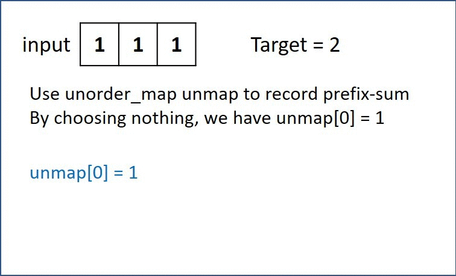

# 560. Subarray Sum Equals K
Given an array of integers nums and an integer k, return the total number of continuous subarrays whose sum equals to k.

[LeetCode](https://leetcode.com/problems/subarray-sum-equals-k)

### Example 1:

```
Input: nums = [1,1,1], k = 2
Output: 2
```

### Example 2:

```
Input: nums = [1,2,3], k = 3
Output: 2
```
### Constraints:

* 1 <= nums.length <= 2 * 10^4
* -1000 <= nums[i] <= 1000
* -10^7 <= k <= 10^7


#  和為K的子數組
給定一個整數數組和一個整數 k，你需要找到該數組中和為 k 的連續的子數組的個數


## Solution  
Hash table



### C++

```
#include <vector>
#include <unordered_map>

using namespace std;

class Solution
{
public:
    int subarraySum(vector<int> &nums, int k)
    {
        unordered_map<int, int> prefix;

        /* set first prefix prefix[0] = 1 we got one zero"0*/
        prefix[0]++;
        int sum = 0;
        int ret = 0;
        for (const auto &number : nums)
        {
            sum += number;
            if (prefix.count(sum - k) != 0)
                ret += prefix[sum - k];

            prefix[sum]++;
        }

        return ret;
    }
};

int main()
{
    vector<int> input{1,2,3};
    Solution test;
    int res = test.subarraySum(input, 3);

    return 0;
}
```