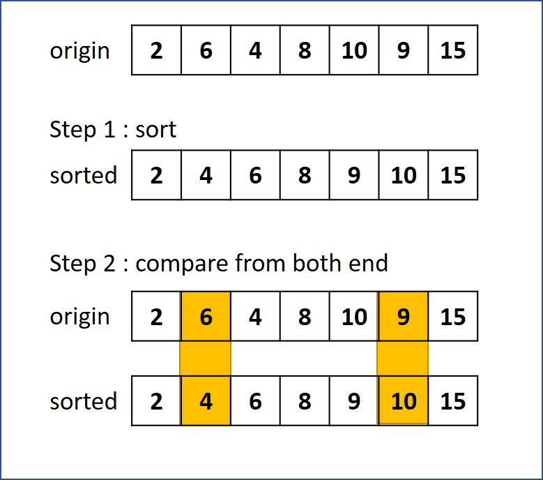

# 581. Shortest Unsorted Continuous Subarray
Given an integer array nums, you need to find one continuous subarray that if you only sort this subarray in ascending order, then the whole array will be sorted in ascending order.

Return the shortest such subarray and output its length.

##  最短無序連續子數組
給你一個整數數組 nums ，你需要找出一個 連續子數組 ，如果對這個子數組進行升序排序，那麽整個數組都會變為升序排序。

請你找出符合題意的 最短 子數組，並輸出它的長度。

[LeetCode](https://leetcode.com/problems/shortest-unsorted-continuous-subarray)

### Example 1:

```
Input: nums = [2,6,4,8,10,9,15]
Output: 5
Explanation: You need to sort [6, 4, 8, 10, 9] in ascending order to make the whole array sorted in ascending order.
```

### Example 2:

```
Input: nums = [1,2,3,4]
Output: 0
```
### Constraints:

* 1 <= nums.length <= 10^4
* -10^5 <= nums[i] <= 10^5


## Solution  



### C++ 1

* 時間複雜度 O(n)

* 空間複雜度 O(1)

```
class Solution
{
public:
    int findUnsortedSubarray(vector<int> &nums)
    {
        int len = nums.size();
        if (len == 1)
            return 0;

        /* search from left, current value greater than any element on the left side*/
        int max = nums[0];
        int upWrong = 0;
        for (int i = 1; i < len; ++i)
        {
            if (nums[i] < max)
                upWrong = i;
            else
                max = nums[i] > max ? nums[i] : max;
        }

        /* search from right, current value smaller than any element on the right side*/
        int min = nums[len - 1];
        int downWrong = len - 1;
        for (int i = len - 2; i >= 0; --i)
        {
            if (nums[i] > min)
                downWrong = i;
            else
                min = nums[i] < min ? nums[i] : min;
        }

        return upWrong == 0 ? 0 : upWrong - downWrong + 1;
    }
};
```

### C++ 2

```
#include <vector>
#include <algorithm>

using namespace std;

class Solution
{
public:
    int findUnsortedSubarray(vector<int> &nums)
    {
        if (nums.size() == 1)
            return 0;

        vector<int> copy(nums.begin(), nums.end());
        sort(copy.begin(), copy.end());

        /* compare origin and sorted array, find the different element */

        int start = 0;
        int end = copy.size();

        while ((start < end) && (nums[start] == copy[start]))
        {
            start++;
        }

        if (start == end)
            return 0;

        while ((end > start) && (nums[--end] == copy[end])){}

        return end - start + 1;
    }
};

int main()
{
    vector<int> input{2,6,4,8,10,9,15};
    Solution test;
    int res = test.findUnsortedSubarray(input);

    return 0;
}
```