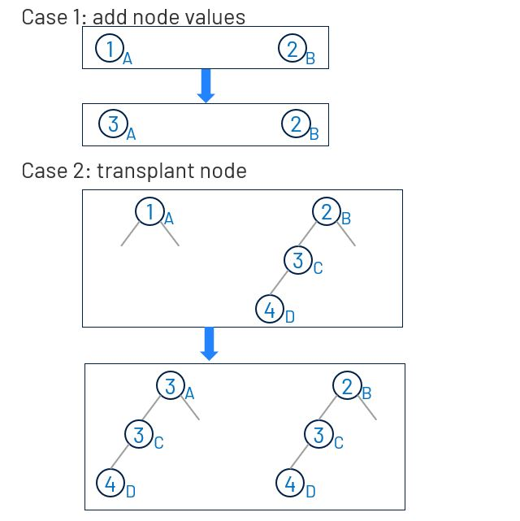
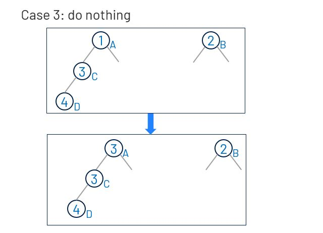

# 617. Merge Two Binary Trees
Given two binary trees and imagine that when you put one of them to cover the other, some nodes of the two trees are overlapped while the others are not.

You need to merge them into a new binary tree. The merge rule is that if two nodes overlap, then sum node values up as the new value of the merged node. Otherwise, the NOT null node will be used as the node of new tree.

[LeetCode](https://leetcode.com/problems/merge-two-binary-trees/)

### Example :
```
Input: 
	Tree 1                     Tree 2                  
          1                         2                             
         / \                       / \                            
        3   2                     1   3                        
       /                           \   \                      
      5                             4   7  
```

```
Output: 
Merged tree:
	     3
	    / \
	   4   5
	  / \   \ 
	 5   4   7
```

### Note
The merging process must start from the root nodes of both trees.


#  合並二叉樹
給定兩個二叉樹，想象當你將它們中的一個覆蓋到另一個上時，兩個二叉樹的一些節點便會重疊。

你需要將他們合並為一個新的二叉樹。合並的規則是如果兩個節點重疊，那麽將他們的值相加作為節點合並後的新值，否則不為 NULL 的節點將直接作為新二叉樹的節點。


## Solution  




### C

```
struct TreeNode *mergeTrees(struct TreeNode *t1, struct TreeNode *t2)
{
    if (t1 == NULL && t2 == NULL)
        return NULL;
    else if (t1 == NULL)
        return t2;
    else if (t2 == NULL)
        return t1;

    t1->val += t2->val;
    t1->left = mergeTrees(t1->left, t2->left);
    t1->right = mergeTrees(t1->right, t2->right);

    return t1;
}
```


