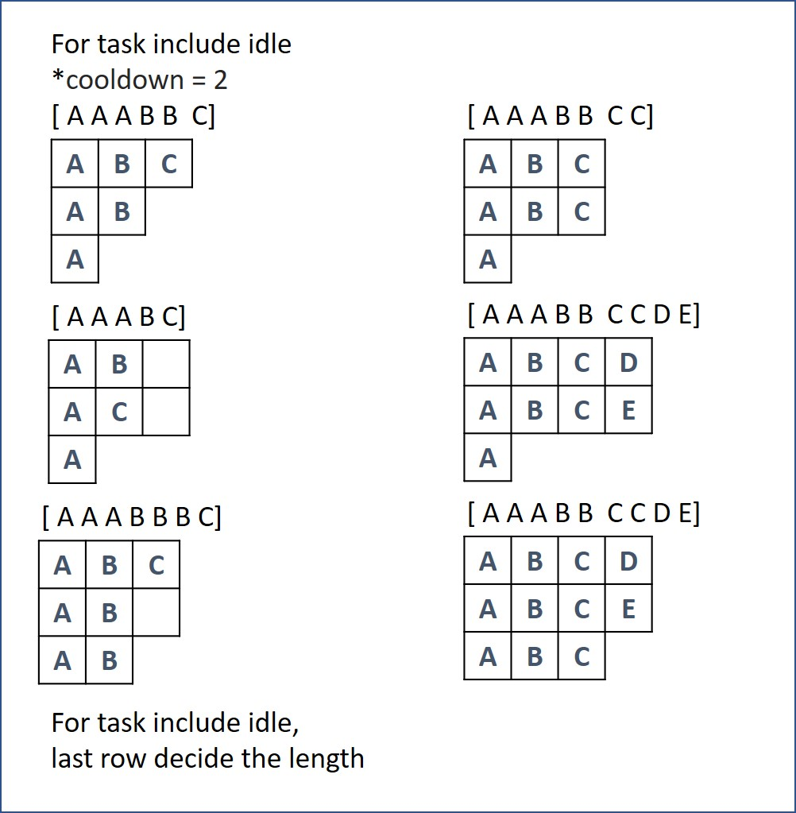

# 621. Task Scheduler
Given a characters array tasks, representing the tasks a CPU needs to do, where each letter represents a different task. Tasks could be done in any order. Each task is done in one unit of time. For each unit of time, the CPU could complete either one task or just be idle.

However, there is a non-negative integer n that represents the cooldown period between two same tasks (the same letter in the array), that is that there must be at least n units of time between any two same tasks.

Return the least number of units of times that the CPU will take to finish all the given tasks.

[LeetCode](https://leetcode.com/problems/task-scheduler)

### Example 1:

```
Input: tasks = ["A","A","A","B","B","B"], n = 2
Output: 8
Explanation: 
A -> B -> idle -> A -> B -> idle -> A -> B
There is at least 2 units of time between any two same tasks.
```

### Example 2:

```
Input: tasks = ["A","A","A","B","B","B"], n = 0
Output: 6
Explanation: On this case any permutation of size 6 would work since n = 0.
["A","A","A","B","B","B"]
["A","B","A","B","A","B"]
["B","B","B","A","A","A"]
...
And so on.
```

### Example 3:
```
Input: tasks = ["A","A","A","A","A","A","B","C","D","E","F","G"], n = 2
Output: 16
Explanation: 
One possible solution is
A -> B -> C -> A -> D -> E -> A -> F -> G -> A -> idle -> idle -> A -> idle -> idle -> A
```
### Constraints:

* 1 <= task.length <= 10^4
* tasks[i] is upper-case English letter.
* The integer n is in the range [0, 100].

#  621. 任務調度器
給你一個用字符數組 tasks 表示的 CPU 需要執行的任務列表。其中每個字母表示一種不同種類的任務。任務可以以任意順序執行，並且每個任務都可以在 1 個單位時間內執行完。在任何一個單位時間，CPU 可以完成一個任務，或者處於待命狀態。

然而，兩個 相同種類 的任務之間必須有長度為整數 n 的冷卻時間，因此至少有連續 n 個單位時間內 CPU 在執行不同的任務，或者在待命狀態。

你需要計算完成所有任務所需要的 最短時間 


## Solution  



### C++

```
#include <vector>
#include <algorithm>

using namespace std;

class Solution
{
public:
    int leastInterval(vector<char> &tasks, int n)
    {
        vector<int> counter(26, 0);
        for (const auto &i : tasks)
            counter[i - 'A']++;

        sort(counter.rbegin(), counter.rend());

        int lastContainerLength = 1;
        int MaxContainer = counter[0];

        for (int i = 1; i < 26; ++i)
        {
            if (counter[i] == MaxContainer)
                ++lastContainerLength;
            else if (counter[i] == 0)
                break;
        }

        int coolDownInclude = (MaxContainer - 1) * (n + 1) + lastContainerLength;
        int noCoolDown = tasks.size();      
        
        return coolDownInclude > noCoolDown?coolDownInclude:noCoolDown;
    }
};

int main()
{
    vector<char> input = {'A', 'A', 'A', 'B', 'B', 'B', 'C', 'C', 'C', 'D', 'D', 'E'};

    Solution test;
    int res = test.leastInterval(input, 2);

    return 0;
}
```