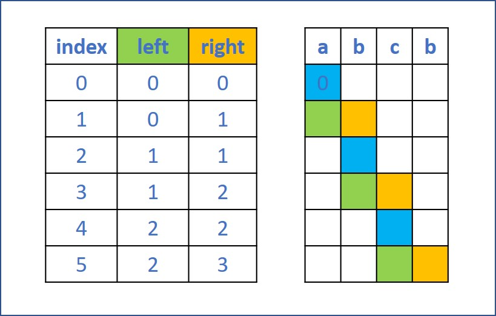

# 647. Palindromic Substrings
Given a string s, return the number of palindromic substrings in it.

A string is a palindrome when it reads the same backward as forward.

A substring is a contiguous sequence of characters within the string.

[LeetCode](https://leetcode.com/problems/palindromic-substrings)

### Example 1:

```
Input: s = "abc"
Output: 3
Explanation: Three palindromic strings: "a", "b", "c".
```

### Example 2:

```
Input: s = "aaa"
Output: 6
Explanation: Six palindromic strings: "a", "a", "a", "aa", "aa", "aaa".
```

### Constraints:

* 1 <= s.length <= 1000
* s consists of lowercase English letters.

#  647. 回文子串
給定一個字符串，你的任務是計算這個字符串中有多少個回文子串。

具有不同開始位置或結束位置的子串，即使是由相同的字符組成，也會被視作不同的子串。


## Solution  



### C++

```
#include <vector>
#include <string>

using namespace std;

class Solution
{
public:
    int countSubstrings(string s)
    {
        int len = s.length();

        if (len == 1)
            return 1;

        int lcen = 0;
        int rcen = 0;
        int ret = 0;

        for (int i = 0; i < 2 * len - 1; ++i)
        {
            lcen = i / 2;
            rcen = lcen + i % 2;
            while ((lcen >= 0) && (rcen < len) && s[lcen--] == s[rcen++])
                ++ret;
        }

        return ret;
    }
};

int main()
{
    string input = {"abcb"};

    Solution test;
    int res = test.countSubstrings(input);

    return 0;
}
```