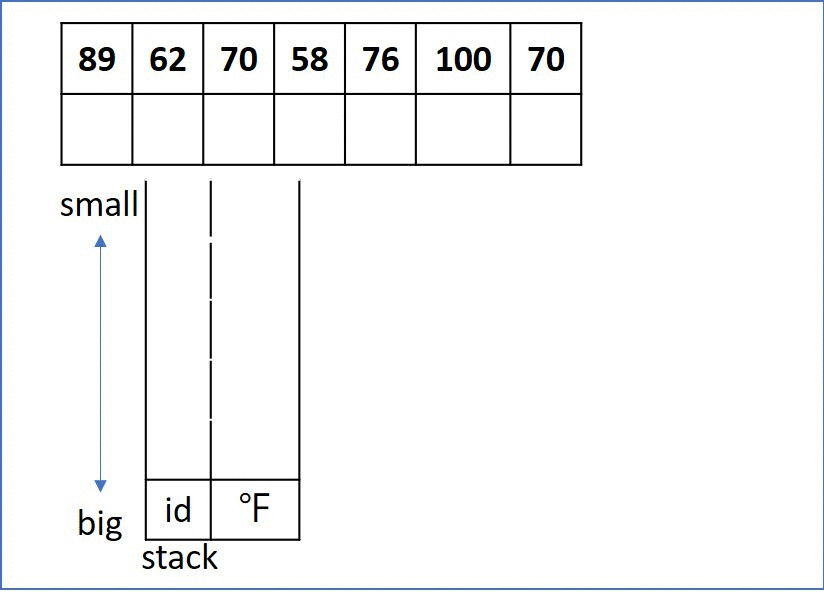

# 739. Daily Temperatures
Given a list of daily temperatures T, return a list such that, for each day in the input, tells you how many days you would have to wait until a warmer temperature. If there is no future day for which this is possible, put 0 instead.

For example, given the list of temperatures T = [73, 74, 75, 71, 69, 72, 76, 73], your output should be [1, 1, 4, 2, 1, 1, 0, 0].

Note: The length of temperatures will be in the range [1, 30000]. Each temperature will be an integer in the range [30, 100].

[LeetCode](https://leetcode.com/problems/daily-temperatures)

# 739. 每日溫度
請根據每日 氣溫 列表，重新生成一個列表。對應位置的輸出為：要想觀測到更高的氣溫，至少需要等待的天數。如果氣溫在這之後都不會升高，請在該位置用 0 來代替。

例如，給定一個列表 temperatures = [73, 74, 75, 71, 69, 72, 76, 73]，你的輸出應該是 [1, 1, 4, 2, 1, 1, 0, 0]。

提示：氣溫 列表長度的範圍是 [1, 30000]。每個氣溫的值的均為華氏度，都是在 [30, 100] 範圍內的整數


## Solution  
* stack



### C++

```
#include <vector>
#include <stack>

using namespace std;

class Solution
{
public:
    vector<int> dailyTemperatures(vector<int> &Temp)
    {
        int len = Temp.size();
        stack<int> day;
        vector<int>ret(len, 0);

        for (int i = 0; i < len; ++i)
        {
            while ((day.empty() != true) && (Temp[i] > Temp[day.top()]))
            {
                int tmp = day.top();
                day.pop();
                ret[tmp] = i-tmp;
            }
            day.push(i);
        }
        return ret;
    }
};

int main()
{
    vector<int> input = {89, 62, 70, 58, 47, 47, 46, 76, 100, 70};

    Solution test;
    vector<int> res = test.dailyTemperatures(input);

    return 0;
}
```